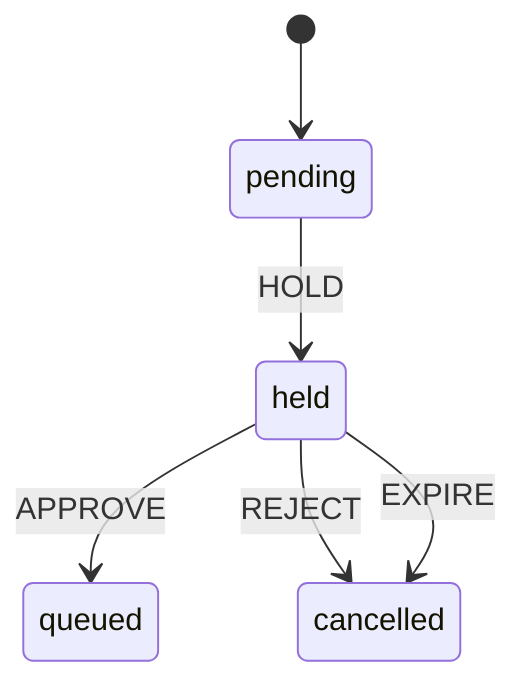

KiCI gates execution on human approval at step, job, and workflow granularity. Every gate, whatever its source, produces the same artifact — a **held element** that pauses execution until its approval requirement is satisfied, rejected, or expired. This page describes the unified model and the step-level round-trip that lets a hold land mid-job.

For authoring gates see [Approval gates (user guide)](../user/approvals.md); for operating them see [Approval gates (operator guide)](../operator/approvals.md).

## One hold, two triggers

Two independent sources can hold an element. They differ only in **what triggers** the hold and **where the approver requirement comes from** — both funnel into the same held-element mechanism.

| Source        | Trigger                                 | Requirement source                                   | Granularity           |
| ------------- | --------------------------------------- | ---------------------------------------------------- | --------------------- |
| **Mandatory** | element targets a protected environment | environment policy (required reviewers)              | job                   |
| **Explicit**  | author wrote `approval` in the SDK      | the clauses in code, resolved against operator teams | step / job / workflow |

The explicit `approval` declaration is compiled into the lock file's `approval` block (at the matching step, job, or workflow node). The mandatory requirement is resolved at dispatch time from the environment's reviewer policy. Both normalize to one shape before the gate evaluates them:

```
ApprovalRequirement = {
  clauses: ApproverClause[]   // AND — all must be satisfied
  expiresAt: timestamp
  reason: string
}
ApproverClause = { team: string } | { user: string }
```

When both a mandatory environment hold and an explicit hold apply to the same job, their clauses are combined into one requirement (AND), so both sources must be satisfied.

## Clause evaluation

A requirement is satisfied when **all** of its clauses are satisfied:

- `{ team: T }` is satisfied once any member of team `T` approves.
- `{ user: U }` is satisfied once `U` approves.
- An empty clause list (`approval: true`) is satisfied by a single approval from any approval-capable member.

Clauses are a flat AND list; one qualifying approver may satisfy several clauses at once (an approver who is both in team `leads` and is user `cto` satisfies both clauses with one decision). Any single rejection rejects the whole element; an expired hold is treated as a rejection.

The orchestrator has no identity store of its own. Team membership and identity links arrive over the control-plane trust-policy push and are cached in memory; clause matching and approver eligibility read only that cached snapshot, never anything carried on the approval request itself. This is the same trust boundary the rest of the CI-security path uses.

Each individual decision is recorded — the approver, the decision, and which clauses it satisfied — so multi-clause progress and per-approver attribution are first-class in the dashboard queue and on the run detail page. Eligibility is enforced at approve time: an actor must be eligible for at least one _unsatisfied_ clause, and self-approval is rejected when the org disables it.

## Hold lifecycle and resume

A held element reuses the execution [state machine](execution/state-machine.md): the `held` state and the `HOLD` / `APPROVE` / `REJECT` / `EXPIRE` events. There are no approval-specific states — workflow- and step-level holds use the same `held` state as the existing job-level hold.



On full satisfaction the held element is **resumed**, through one path shared by the dashboard and CLI approve flows:

- **Job or workflow scope** — the released element is re-dispatched (enqueued for dispatch). A workflow-level hold gates the run's first dispatch; releasing it lets the run's jobs proceed.
- **Step scope** — the orchestrator signals the waiting agent (see [the round-trip](#step-level-round-trip)) rather than enqueuing anything.

A rejection or an expiry instead fails the element via the `REJECT` / `EXPIRE` transition, which fails the run. The stale run detector sweeps overdue holds and drives the expiry side.

## Step-level round-trip

A step-level gate must pause a job _mid-execution_, after earlier steps have run, with the workspace and prior-step state intact. The agent runs a job as one unit, so this requires a round-trip between the agent and its orchestrator over two protocol messages on the [orchestrator ↔ agent](protocol/orchestrator-agent.md) channel.

```mermaid
sequenceDiagram
    participant Agent
    participant Orchestrator
    participant Approver

    Note over Agent: runs earlier steps
    Agent->>Orchestrator: step.approval-request<br/>(runId, jobId, stepIndex, requirement)
    Note over Orchestrator: create step-scoped held element
    Note over Agent: blocks step loop;<br/>keeps heartbeating
    Approver->>Orchestrator: approve (dashboard / kici approve)
    Note over Orchestrator: all clauses satisfied → release
    Orchestrator->>Agent: step.approval-resolved<br/>(outcome: approved)
    Note over Agent: runs the held step,<br/>then continues the job
```

- **`step.approval-request`** (agent → orchestrator) carries `runId`, `jobId`, `stepIndex`, `stepName`, and the normalized `requirement`. The orchestrator creates a step-scoped held element for it.
- The agent blocks its step loop and `await`s resolution, keeping the sandbox and workspace live. Heartbeats continue throughout so the agent is not reaped while waiting.
- **`step.approval-resolved`** (orchestrator → agent) carries `requestId` (correlating to the request), `runId`, `jobId`, `stepIndex`, and an `outcome` of `approved`, `rejected`, or `expired`. On `approved` the agent runs the held step against its intact workspace and continues the job. On `rejected` or `expired` it fails the job with a clear reason.

These two messages are ordinary protocol messages; they do not affect the heartbeat and log-chunk fast paths.

Because a step-level hold keeps an agent and workspace occupied for the whole wait, it is bounded by the hold's expiry. Operators size this with `approval_expiry_seconds` (or a per-gate `timeout`); see the [agent-occupancy note](../operator/approvals.md#agent-occupancy-during-step-level-holds).

## See also

- [Approval gates (user guide)](../user/approvals.md) — authoring `approval`.
- [Approval gates (operator guide)](../operator/approvals.md) — teams, the queue, expiry, self-approval.
- [Execution state machine](execution/state-machine.md) — the `held` state and its transitions.
- [Orchestrator ↔ Agent messages](protocol/orchestrator-agent.md) — the protocol channel the step round-trip rides.
