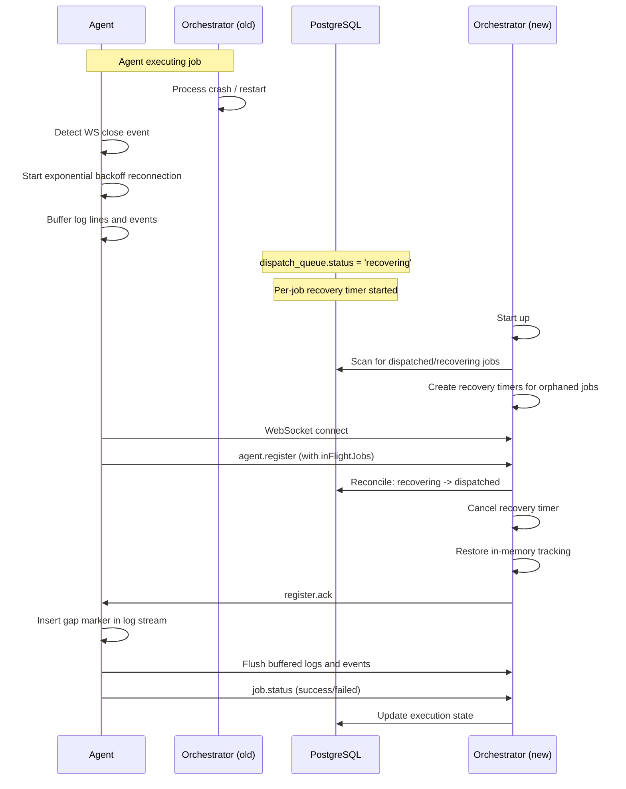
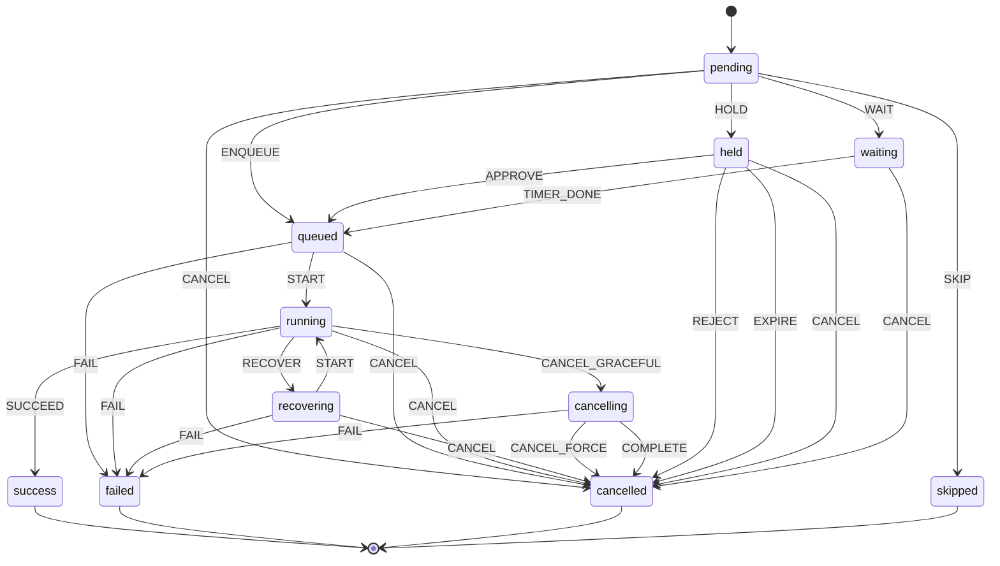

When the orchestrator restarts (planned upgrade, crash, or resource pressure), agents lose their WebSocket connection but continue executing in-flight jobs. This page documents the recovery protocol that lets jobs survive orchestrator restarts: grace periods, per-job recovery timers, inFlightJobs reporting, log continuity with gap markers, startup recovery, and failure modes.

## Overview

When an agent disconnects, each in-flight job enters a `recovering` state with a per-job grace timer. If the agent reconnects before the timer expires, the job is restored and continues streaming logs (with a gap marker covering the disconnected window). If the timer fires, the job is permanently failed with a specific error message. This lets jobs survive orchestrator restarts cleanly — without recovery, every disconnect would mark every dispatched job as failed even though the agent is still executing.

**Key design decisions:**

- Grace period is auto-derived: 2x the max reconnection delay (default 60s max delay = 120s grace)
- Per-job timers, not a global sweep -- each job gets its own deadline from when its agent disconnected
- No separate configuration knob for the grace period (less for operators to think about)
- `recovering` is a real DB column value in `dispatch_queue` -- operators can query it directly

## Recovery protocol

### Sequence diagram



### Step-by-step flow

1. **Agent disconnect detection:** The orchestrator detects the WebSocket `close` event for a registered agent.

2. **Disconnect triage by agent kind:** `Dispatcher.onAgentDisconnect()` first checks whether the agent was spawned by a scaler backend.
   - **Static agents** (a static agent can reconnect after a network blip) get per-job recovery timers — for each in-flight job the dispatcher transitions `dispatch_queue.status` from `dispatched` to `recovering`, creates a `setTimeout` timer with the grace period (2x `maxReconnectDelayMs`), and stores recovery metadata (`agentId`, `runId`, `timer`, `disconnectedAt`). The remaining steps describe this path.
   - **Scaler-managed agents** are single-use — the scaler destroys them on disconnect, so reconnection is impossible and a recovery window cannot succeed. Their in-flight jobs are triaged instead: a job that never reached `running` is immediately requeued for another agent (bumping `dispatch_queue.dispatch_attempts`), while a job that had already started executing is failed fast (steps may have external side effects, so silently re-running it is not safe). See [Scaler-managed agent disconnect](#scaler-managed-agent-disconnect) under failure modes.

3. **Agent reconnection:** The agent detects the WS close and starts exponential backoff reconnection (1s base, 1.5x multiplier, jitter, 60s max). When the new orchestrator is ready, the agent connects.

4. **inFlightJobs reporting:** The agent sends `agent.register` with an optional `inFlightJobs` array containing `{ jobId, runId }` entries for each currently executing job.

5. **Orchestrator reconciliation:** The `reconcileInFlightJobs` helper processes each reported job:
   - Calls `dispatcher.reconcileRecovery(jobId, agentId)` which:
     - Claims the recovery timer (cancels the timeout)
     - Transitions `dispatch_queue.status` from `recovering` back to `dispatched`
     - Restores in-memory `agentJobs`/`jobToAgent` tracking
   - Increments the agent's `activeJobs` count in the registry
   - Emits a structured log with `recovery_duration`, `agent_id`, `job_id`
   - Sends `job.status: running` to update `execution_jobs` state

6. **Log replay:** The agent flushes its buffered events and log lines with original timestamps, preceded by a gap marker.

7. **Job completion:** The job continues normally. When it finishes, the agent sends `job.status` (success/failed) and the orchestrator updates the execution state and check run as usual.

> See `packages/orchestrator/src/agent/dispatcher.ts` for recovery timer management, `packages/orchestrator/src/ws/agent-handler.ts` for `reconcileInFlightJobs`, and `packages/agent/src/ws/orchestrator-client.ts` for inFlightJobs reporting.

## Execution state machine

The execution state machine includes 11 states, with `recovering` being the state relevant to agent reconnection.

### State diagram

The full 11-state execution state machine (showing the `recovering` state relevant to agent reconnection, plus `cancelling`, `held`, and `waiting` states added by other features):



### Transition table

| From State   | Event           | To State     | Trigger                                   |
| ------------ | --------------- | ------------ | ----------------------------------------- |
| `pending`    | ENQUEUE         | `queued`     | Job added to dispatch queue               |
| `pending`    | CANCEL          | `cancelled`  | Cancelled before dispatch                 |
| `pending`    | SKIP            | `skipped`    | Rule evaluation skips the job             |
| `pending`    | HOLD            | `held`       | Protection rule: reviewer required        |
| `pending`    | WAIT            | `waiting`    | Protection rule: wait timer               |
| `queued`     | START           | `running`    | Agent begins execution                    |
| `queued`     | FAIL            | `failed`     | Queue error or agent failure              |
| `queued`     | CANCEL          | `cancelled`  | Cancelled while queued                    |
| `running`    | SUCCEED         | `success`    | Job completed successfully                |
| `running`    | FAIL            | `failed`     | Job execution failed                      |
| `running`    | CANCEL          | `cancelled`  | Job cancelled during execution            |
| `running`    | CANCEL_GRACEFUL | `cancelling` | Graceful cancellation with cleanup hooks  |
| `running`    | RECOVER         | `recovering` | Agent disconnected (orchestrator restart) |
| `recovering` | START           | `running`    | Agent reconnected, job reclaimed          |
| `recovering` | FAIL            | `failed`     | Grace period expired (recovery timeout)   |
| `recovering` | CANCEL          | `cancelled`  | Job cancelled during recovery             |
| `cancelling` | CANCEL_FORCE    | `cancelled`  | Force cancel after grace period           |
| `cancelling` | COMPLETE        | `cancelled`  | Cleanup hooks completed                   |
| `cancelling` | FAIL            | `failed`     | Cleanup hook failure                      |
| `held`       | APPROVE         | `queued`     | Reviewer approved                         |
| `held`       | REJECT          | `cancelled`  | Reviewer rejected                         |
| `held`       | EXPIRE          | `cancelled`  | Hold expiry exceeded                      |
| `held`       | CANCEL          | `cancelled`  | Cancelled while held                      |
| `waiting`    | TIMER_DONE      | `queued`     | Wait timer completed                      |
| `waiting`    | CANCEL          | `cancelled`  | Cancelled while waiting                   |

### Key properties

- **`recovering` is non-terminal:** `TERMINAL_STATES` remains `['success', 'failed', 'cancelled', 'skipped']`. Jobs in `recovering` can still transition to `running`, `failed`, or `cancelled`.
- **RECOVER only from `running`:** Prevents double-recover. A job already in `recovering` cannot receive RECOVER again.
- **START reused for reconnection:** The `recovering -> running` transition reuses the existing START event rather than introducing a new RECONNECT event.
- **`cancelling` supports graceful shutdown:** Running jobs can enter `cancelling` via CANCEL_GRACEFUL, allowing cleanup hooks to run before the final `cancelled` state.
- **`held` and `waiting` are non-terminal:** These states support environment protection rules (reviewer gates and wait timers).

> See `packages/engine/src/state-machine/types.ts` and `packages/engine/src/state-machine/machine.ts` for the implementation.

## Log continuity

### Gap markers

When the agent reconnects and flushes buffered messages, it inserts a gap marker as a log line before the replayed content. The gap marker gives operators full context about the outage.

**Format:**

```
--- Orchestrator offline for 45s. Replaying 12 buffered events and 238 buffered log lines. ---
```

If buffer overflow occurred during the outage:

```
--- Orchestrator offline for 120s. Replaying 0 buffered events and 5000 buffered log lines. 2847 log lines dropped due to buffer overflow. ---
```

### Buffer limits

| Buffer       | Max Size | Purpose                                           |
| ------------ | -------- | ------------------------------------------------- |
| Event buffer | 5,000    | Protocol messages (heartbeats, etc.) via `send()` |
| Log buffer   | 10,000   | Log lines from step execution via `streamLog()`   |

### Overflow handling

When a buffer reaches capacity:

1. The oldest item is dropped (`RingBuffer.shift()`)
2. A `droppedCount` counter is incremented
3. On flush, the gap marker includes the exact count of dropped items
4. `resetDroppedCount()` is called after the gap marker is sent

All buffered messages carry their **original timestamps** from when the agent produced them, not the replay time.

> See `packages/shared/src/ring-buffer.ts` for `droppedCount` tracking, and `packages/agent/src/ws/orchestrator-client.ts` for gap marker insertion and buffer flush.

## Startup recovery

When the orchestrator starts (or restarts), it must handle jobs from the previous instance that are still in the database.

### Recovery flow on startup

1. **Orphaned `recovering` jobs:** `StaleRunDetector.cleanupOrphanedRecoveryJobs()` finds any jobs left in `recovering` state from a previous orchestrator instance. These are permanently failed with the message: "Job failed: orchestrator restarted during recovery (recovery state lost)". This runs **before** the first stale detection scan.

2. **Dispatched jobs from previous instance:** After cleanup, the startup scan queries `dispatch_queue WHERE status = 'dispatched'`. For each:
   - The job is transitioned to `recovering`
   - A new recovery timer is created with `agentId = 'unknown'` (the previous orchestrator's in-memory agent mapping is lost)
   - If the agent reconnects and claims the job, it is restored normally
   - If the timer expires, the job is permanently failed

3. **Interaction with stale detection:** The stale run detector queries for `status = 'running'` jobs. Since recovering jobs are in `recovering` state (not `running`), they are naturally excluded from stale detection scans.

> See `packages/orchestrator/src/stale-detector/stale-run-detector.ts` for `cleanupOrphanedRecoveryJobs()`, and `packages/orchestrator/src/orchestrator-core.ts` for the startup recovery scan.

## Failure modes

### Grace period expiry

| Aspect        | Behavior                                                                                |
| ------------- | --------------------------------------------------------------------------------------- |
| Trigger       | Recovery timer fires (agent did not reconnect within grace period)                      |
| Job outcome   | Permanently failed                                                                      |
| Error message | "Job failed: agent disconnected and did not reconnect within the recovery window"       |
| DB transition | `recovering -> failed` (via `markFailedIfRecovering` -- optimistic concurrency)         |
| Partial logs  | Any logs received before the outage are preserved in the execution report               |
| Scaler        | `onJobFailedPermanently` callback notifies the scaler to avoid spinning up replacements |

### Scaler-managed agent disconnect

Scaler-managed agents are single-use and destroyed on disconnect, so they never enter the recovery window. Their in-flight jobs are triaged immediately:

| Aspect            | Behavior                                                                                                                                                                         |
| ----------------- | -------------------------------------------------------------------------------------------------------------------------------------------------------------------------------- |
| Never-started job | Requeued to `pending` (bumps `dispatch_queue.dispatch_attempts`) and immediately re-dispatched to another agent, or handed to the scaler so a fresh agent is spawned bound to it |
| Started job       | Failed fast — "Job failed: scaler-managed agent disconnected mid-execution"; not re-run, since steps may have external side effects                                              |
| Attempt cap       | A job re-dispatched more than `MAX_DISPATCH_ATTEMPTS` (5) times is failed permanently instead of requeued again; `expires_at` is the time-based backstop                         |
| No dead wait      | There is no 2-minute recovery timeout for these agents — the outcome (requeue or fail) is decided at disconnect                                                                  |

### Orchestrator crash during recovery

| Aspect          | Behavior                                                                         |
| --------------- | -------------------------------------------------------------------------------- |
| Trigger         | Orchestrator crashes while recovery timers are active                            |
| Job outcome     | `recovering` state persists in DB until next startup                             |
| Startup cleanup | `cleanupOrphanedRecoveryJobs` fails all orphaned recovering jobs on next startup |
| Agent behavior  | Agent continues executing, buffers messages, and reconnects to the new instance  |

### Agent crash during recovery

| Aspect          | Behavior                                                                           |
| --------------- | ---------------------------------------------------------------------------------- |
| Trigger         | Agent crashes while the orchestrator is waiting for reconnection                   |
| Job outcome     | Recovery timer expires, job permanently failed                                     |
| Alternative     | If agent restarts with no in-flight jobs, it registers fresh (no recovery needed)  |
| Stale detection | If the agent never reconnects, the stale run detector handles cleanup after timers |

### Race between timer and reconnection

| Aspect         | Behavior                                                                                    |
| -------------- | ------------------------------------------------------------------------------------------- |
| Trigger        | Agent reconnects at nearly the same moment the recovery timer fires                         |
| Resolution     | Optimistic concurrency via `claimRecovery`                                                  |
| Timer path     | `markFailedIfRecovering`: `UPDATE WHERE status = 'recovering'` -- 0 rows if already claimed |
| Reconnect path | `claimRecovery` deletes from `recoveringJobs` Map + `clearTimeout` atomically               |
| Guarantee      | Exactly one path succeeds -- the Map serves as the coordination point                       |

## Observability

### Structured log fields

Recovery events are logged with the following structured fields for ELK dashboards and alerting:

| Field                     | Type   | Description                                   |
| ------------------------- | ------ | --------------------------------------------- |
| `recovery_duration`       | number | Milliseconds between disconnect and reconnect |
| `agent_id`                | string | Agent that reconnected                        |
| `job_id`                  | string | Job that was recovered                        |
| `run_id`                  | string | Execution run ID                              |
| `buffered_messages_count` | number | Messages buffered during outage               |

### Database queries

Operators can query the `dispatch_queue` table to monitor recovery state:

```sql
-- Count jobs currently in recovery
SELECT count(*) FROM dispatch_queue WHERE status = 'recovering';

-- Find recovering jobs with their age
SELECT id, run_id, created_at, now() - created_at AS age
FROM dispatch_queue
WHERE status = 'recovering'
ORDER BY created_at;

-- Check recent recovery timeouts
SELECT id, run_id, error_message, updated_at
FROM dispatch_queue
WHERE status = 'failed'
  AND error_message LIKE '%recovery timeout%'
ORDER BY updated_at DESC
LIMIT 10;
```

### ELK dashboard suggestions

- **Recovery rate:** Count log events with message "Job recovered from agent reconnection" per time window
- **Average recovery duration:** Aggregate `recovery_duration` field from recovery log events
- **Recovery timeouts:** Count events with message containing "recovery timeout exceeded"
- **Buffer overflow frequency:** Count gap markers that include "dropped due to buffer overflow"

## See also

- [Reconnection and Event Buffering](reconnection.md) -- WebSocket reconnection behavior and message buffering
- [State Machine](../execution/state-machine.md) -- Full execution state machine reference
- [Job Execution Lifecycle](../execution/job-execution.md) -- Agent job lifecycle from dispatch to cleanup
- [Stale Detection](../execution/stale-detection.md) -- Stale run detector behavior
- [Orchestrator Configuration](../configuration.md) -- Orchestrator settings
