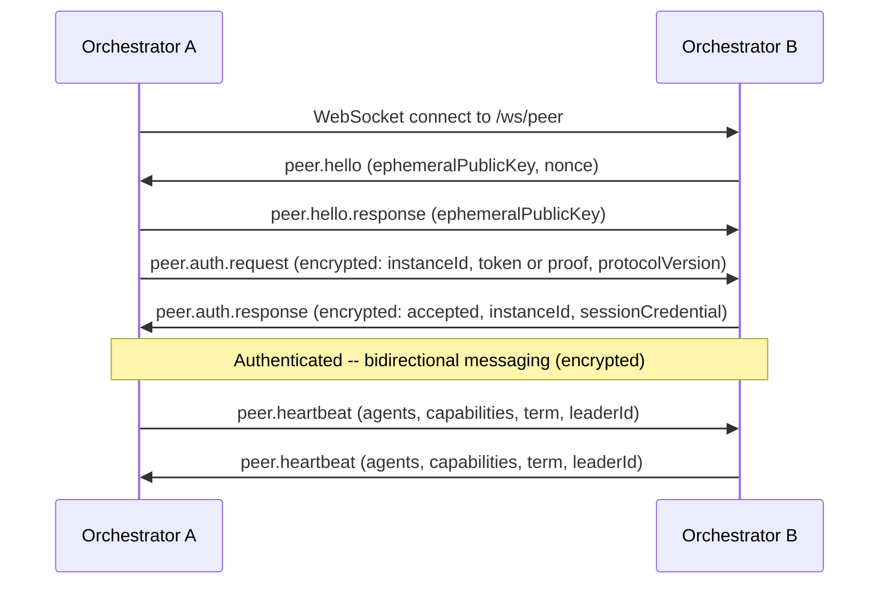
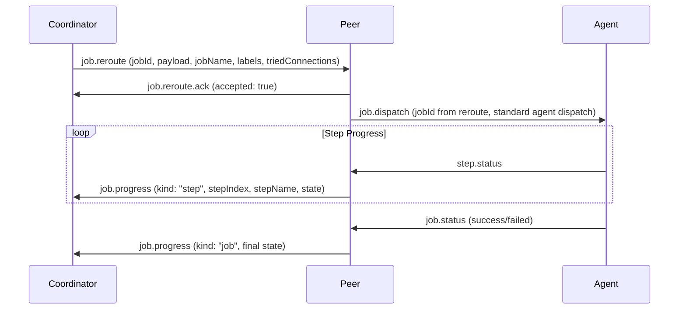
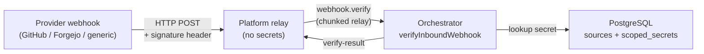
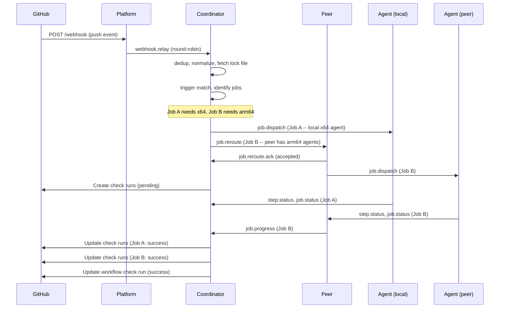

KiCI supports running multiple orchestrators in a cluster for high availability, cross-architecture job routing, and dedicated coordinator topologies. This document covers the architecture, protocols, and design decisions.

## Design overview

### Coordinator/worker model

Every webhook event has exactly one **run coordinator** -- the orchestrator that received the webhook from the Platform relay. The Platform tier uses round-robin load balancing across orchestrators registered with the same routing key; it has no awareness of cluster topology.

The coordinator:

1. Receives the webhook payload from Platform
2. Performs deduplication, trigger matching, and lock file evaluation
3. Creates GitHub check runs as "pending" (immediate user feedback)
4. Claims jobs it can dispatch to its own local agents
5. Reroutes remaining jobs to peer orchestrators with matching agent capacity
6. Tracks job progress from all sources (local agents + peers)
7. Updates GitHub check runs as jobs complete
8. Handles cancel propagation to peers

A peer (worker) that receives a rerouted job:

1. Validates the reroute (loop prevention, capacity check)
2. Dispatches the job to a local agent
3. Reports step-by-step progress back to the coordinator
4. Reports job completion back to the coordinator

### Single-orchestrator behavior

When clustering is disabled or no peers are connected, all cluster code is dormant. The coordinator field on the pipeline processor is `undefined`, and the existing direct dispatch path is used. This ensures zero overhead for single-orchestrator deployments.

Even with clustering enabled, the coordinator path only activates when `hasConnectedPeers()` returns true. A cluster of one self-elects as Raft leader and operates identically to a non-clustered orchestrator.

## Communication topology

Orchestrators participate in three communication channels. Understanding which messages flow where is critical for network planning, firewall rules, and debugging.

### Channel summary

| Channel                               | Transport                                    | Messages                                                                                                                                               |
| ------------------------------------- | -------------------------------------------- | ------------------------------------------------------------------------------------------------------------------------------------------------------ |
| **Platform ↔ Orchestrator**           | WS (orch connects outbound to Platform)      | Webhook relay, source registration, execution telemetry, peer discovery                                                                                |
| **Orchestrator ↔ Orchestrator (P2P)** | WS (initiator connects to peer's `/ws/peer`) | Peer auth, heartbeat (agent inventory + scaler capacity), job reroute, job progress, cancel propagation, log relay, cache upload relay, Raft consensus |
| **Orchestrator ↔ Agent**              | WS (agent connects outbound to orch)         | Job dispatch, job/step status, log streaming, event emit                                                                                               |

### What flows P2P vs upstream

The KiCI Platform is primarily a **webhook router and peer matchmaker**, not a general message bus. Inter-orchestrator coordination — peer auth (`peer.hello` / `peer.auth.request`), heartbeats (agent inventory, scaler capacity, Raft state, drain status), job rerouting (`job.reroute`, `job.progress`, `peer.job.cancel`, `peer.log.chunk`), cache upload relay, and Raft consensus — never touches the upstream tier; it flows strictly between orchestrators on the `/ws/peer` channel. Execution telemetry (lifecycle events, run/job/step status forwards, log chunks) flows the other direction, from each orchestrator up to the Platform tier so the dashboard can render it. See [Protocol overview](../protocol/overview.md) for the message-by-message breakdown across each channel.

## Peer communication

### Discovery

Peers discover each other through two mechanisms:

1. **Platform matchmaker (Platform/hybrid modes):** When an orchestrator sends `source.register`, the Platform responds with `source.register.ack` that includes a `peers` array listing all other orchestrators registered with overlapping routing keys. The Platform also sends `peer.discover` messages when new orchestrators connect.

2. **Static configuration (independent mode):** Operators configure `KICI_CLUSTER_PEERS` with comma-separated peer addresses. Each orchestrator creates `PeerClient` instances for all configured peers at startup.

### Connection establishment



- **Direct WS preferred** -- orchestrators proactively connect to all known peers
- **ECDH encrypted channel** -- X25519 key exchange establishes an encrypted channel before any auth material is sent
- **Join token or credential auth** -- first connection uses a one-time join token; subsequent connections use an HMAC credential proof
- **Protocol version check** -- version mismatch logged as warning but accepted (forward compatibility)
- **Auth timeout** -- incoming connections must authenticate within 15 seconds or get disconnected
- **Rate limiting** -- 5 failed auth attempts per IP within 60 seconds triggers temporary block
- **Auto-reconnect** -- exponential backoff with jitter (1s base, 1.5x multiplier, 60s max)

### Heartbeat

Every 30 seconds (configurable), each peer sends a `peer.heartbeat` containing:

- **Agent inventory:** per-agent summary (agent ID, labels, active jobs, max concurrency, platform, architecture)
- **Scaler capacity:** per-backend summary (label sets, max agents, active count) — enables routing to peers with on-demand scaling capacity even if no agents are currently connected
- **Drain status:** whether the orchestrator is shutting down gracefully
- **Capabilities:** feature flags (`s3LogAccess`, optional `logRoutingOverride`)
- **Raft state:** current term and known leader ID
- **Config version:** shared config version counter for cross-orchestrator config sync detection
- **Registry version:** workflow registration version counter for cross-orchestrator registration sync
- **Timestamp:** heartbeat send time (milliseconds)

This inventory is the basis for routing decisions. The coordinator consults the peer registry to find peers with matching capacity — either connected agents with available slots, or scaler backends that can provision agents for the required label sets.

## Rerouting protocol

### Job reroute flow



### Reroute message details

The `job.reroute` message contains:

| Field                           | Description                                                                                                                                                                                                          |
| ------------------------------- | -------------------------------------------------------------------------------------------------------------------------------------------------------------------------------------------------------------------- |
| `messageId`                     | Unique message ID for ACK correlation                                                                                                                                                                                |
| `jobId`                         | Pre-allocated job ID. The sending coordinator allocates it before reroute so its `execution_runs` / `execution_jobs` rows reference the same id the receiving peer will dispatch under and forward progress against. |
| `runId`                         | Execution run identifier                                                                                                                                                                                             |
| `deliveryId`                    | Original webhook delivery ID                                                                                                                                                                                         |
| `routingKey`                    | Provider routing key (e.g., `github:12345`)                                                                                                                                                                          |
| `event`, `action`               | Webhook event type and action                                                                                                                                                                                        |
| `payload`                       | Full webhook payload for independent trigger matching                                                                                                                                                                |
| `jobName`                       | Name of the job to execute                                                                                                                                                                                           |
| `workflowName`                  | Workflow containing the job                                                                                                                                                                                          |
| `runsOnLabels`                  | Label sets the job requires                                                                                                                                                                                          |
| `triedConnections`              | Array of instance IDs already tried (loop prevention)                                                                                                                                                                |
| `maxHops`                       | Maximum allowed hops (default: 3)                                                                                                                                                                                    |
| `coordinatorId`                 | Instance ID of the run coordinator                                                                                                                                                                                   |
| `requestId`, `traceId`          | Full trace context for distributed tracing                                                                                                                                                                           |
| `jobConfig`                     | Resolved job configuration (steps, rules, matrix, etc.) so the peer can dispatch without re-resolving                                                                                                                |
| `repoUrl`, `ref`, `sha`         | Repository clone URL, git ref, and commit SHA                                                                                                                                                                        |
| `provider`                      | Provider type (e.g., `github`)                                                                                                                                                                                       |
| `providerContext`               | Provider-specific context (e.g., `{ installationId }`)                                                                                                                                                               |
| `sourceTarUrl`, `sourceTarHash` | Pre-signed `.kici/` source tarball URL + workflow `contentHash` (cache hit)                                                                                                                                          |
| `depsUrl`, `depsHash`           | Pre-signed dependency tarball download URL and SHA-256 tarball-bytes hash (cache hit)                                                                                                                                |
| `excludeLabels`                 | Labels that the dispatched agent must NOT have (optional)                                                                                                                                                            |
| `cloneToken`                    | Pre-resolved clone token for workers without provider credentials                                                                                                                                                    |
| `encryptedSecrets`              | Encrypted secrets envelope (AES-256-GCM with session key)                                                                                                                                                            |
| `encryptedNamespacedSecrets`    | Encrypted namespaced secrets envelope                                                                                                                                                                                |

> Authoritative source: `packages/engine/src/protocol/messages/peer.ts` — `jobRerouteSchema`

### Routing algorithm

1. **Local-first:** The coordinator checks its own agent registry for agents matching the job's labels
2. **Peer fallback:** If no local agents match, the coordinator queries the peer registry for peers with matching capacity
3. **Capacity sorting:** Peers are sorted by available capacity (most capacity first) to balance load
4. **Sequential fallback:** If a peer rejects or times out (15s), the coordinator tries the next peer
5. **Parallel fan-out:** Jobs targeting different peers are rerouted concurrently via `Promise.all`

Local matching and peer-side capacity matching share the same predicate: a scaler is considered when its label set is a superset of the job's `runsOn`, none of its labels appear in the job's `excludeLabels`, and (when configured) the job's `runsOn` includes every label declared in the scaler's `mandatoryLabels` opt-in gate. The gate is propagated over the heartbeat protocol so cross-peer reroute decisions enforce it identically.

### Loop prevention

Two mechanisms prevent routing loops:

- **triedConnections array:** Each reroute appends the sender's instance ID. Recipients reject messages where their own ID is already in the list.
- **maxHops counter:** Hard limit of 3 hops. Recipients reject messages where `triedConnections.length >= maxHops`.

### Cancel propagation

When a run is cancelled (via API or fail-fast), the coordinator sends `peer.job.cancel` to all peers with rerouted jobs for that run. Cancels are grouped by peer for efficient messaging.

## Raft consensus

### Purpose

KiCI uses a minimal Raft implementation for **leader election only** (no log replication). The Raft leader handles cluster-wide operations that must run on exactly one node:

- **Orphan recovery:** Detecting and finalizing runs from crashed coordinators
- **Cron scheduling:** Evaluating cron-triggered workflows to prevent duplicate firings across cluster nodes

### State machine

```
follower -> candidate -> leader
    ^           |            |
    |           v            |
    +--- (higher term) <----+
```

- **Follower:** Default state. Listens for leader heartbeats and vote requests. Starts election if no heartbeat received within election timeout.
- **Candidate:** Increments term, votes for self, requests votes from peers. Becomes leader with majority.
- **Leader:** Sends periodic heartbeats (every 2s), runs leader-only services.

### Election parameters

| Parameter        | Default | Description                                                                                    |
| ---------------- | ------- | ---------------------------------------------------------------------------------------------- |
| Election timeout | 5-10s   | Randomized jitter prevents simultaneous elections. WAN-appropriate.                            |
| Leader heartbeat | 2s      | Raft-specific heartbeat for leader liveness detection (separate from 30s inventory heartbeat). |

### Dormant mode

When the peer registry has 0 connected peers, the Raft node self-elects immediately. This makes single-orchestrator deployments trivially self-elected leaders without any special-casing. If peers connect later, normal election resumes.

### State persistence

Raft state (currentTerm, votedFor, leaderId) is persisted to the `raft_state` PostgreSQL table via upsert. Persistence uses fire-and-forget (`.catch()`) to avoid blocking election transitions on DB writes.

## Webhook secret management

### Architecture

Webhook secrets live exclusively on the orchestrator side, stored in the orchestrator's shared PostgreSQL database (`scoped_secrets` table, read by `PgSecretStore`). The Platform tier never holds or caches webhook signing material — it asks the matching orchestrator to verify each inbound webhook over the chunked relay protocol.



### Flow

1. The provider POSTs a webhook to the Platform relay with the signature header (e.g. `X-Hub-Signature-256` for GitHub).
2. Platform routes the delivery to the orchestrators registered for the routing key and forwards the raw body + headers over the chunked relay protocol.
3. The orchestrator's `verifyInboundWebhook` dispatcher loads the active secret(s) for the routing key from `PgSecretStore` on demand and checks the signature itself.
4. The orchestrator returns a verify-result over the same relay channel. Platform accepts or rejects the delivery based on the orchestrator's answer.

Because verification runs on the orchestrator, secrets never leave customer infrastructure and Platform stays stateless with respect to webhook signing material.

### Dual-secret rotation

The orchestrator supports multiple active secrets per routing key. During rotation:

1. Add a new secret row (old secret remains active).
2. Update the provider to use the new secret.
3. Wait for old-secret deliveries to drain.
4. Delete or expire the old secret row.

The verifier checks every active secret for the routing key, so old and new signatures both validate during the overlap window.

### source.register decoupling

The `source.register` message the orchestrator sends to Platform on (re)connect carries only routing keys — no webhook secrets. Platform uses the routing-key list to map incoming deliveries to the right orchestrator and then asks that orchestrator to perform verification. This keeps connection-establishment messages free of secret material and lets secrets update independently of registration. Platform's `UnknownSourceCache` short-circuits deliveries whose routing key matches no registered orchestrator, with negative caching (5-minute TTL) to avoid hammering the registry on bogus traffic.

## Orphan recovery

When a coordinator crashes mid-run, its jobs may be stuck. The Raft leader runs periodic orphan recovery:

1. **Scan:** Find `execution_runs` in "running" state with stale timestamps (> 5 minutes)
2. **Check coordinator:** Look up the run's `routing_key` in the peer registry. If a connected peer shares the routing key, the coordinator may still be alive -- skip.
3. **Check jobs:** For each non-terminal job, check the heartbeat timestamp. Mark jobs with stale heartbeats (> 3 minutes) as failed.
4. **Finalize:** When all jobs are terminal, compute overall run status (failed if any failed, cancelled if any cancelled, success otherwise).

The Raft leader guard (`if (!raft.isLeader()) return`) prevents multiple orchestrators from racing to recover the same run.

## Failure modes

### Peer crash mid-job

The peer's agent continues executing until it detects the connection loss. The coordinator marks the peer as disconnected in the peer registry. Jobs dispatched to that peer are considered failed when the peer disconnects.

### Coordinator crash mid-run

Peers that have accepted rerouted jobs complete their jobs independently. The Raft leader detects the orphaned run during periodic recovery and finalizes it based on job terminal states.

### Platform relay down

Direct peer connections continue functioning. Orchestrators that were discovered via the Platform matchmaker maintain their existing peer connections. New peer discovery is paused until the Platform connection recovers.

### Network partition

If an orchestrator loses connectivity to peers, it continues processing webhooks and dispatching to local agents. Jobs that require peer rerouting fail with "No orchestrator in cluster has matching agents." When connectivity recovers, peer connections are re-established via auto-reconnect.

## Log routing

### Pool validation

Multi-orchestrator pools **recommend shared S3 log storage** for consistent log access across all pool members. When a second orchestrator joins a pool (same `orgId:routingKey`), the Platform checks whether all pool members declare `s3LogAccess: true` in their `source.register` message. If there is a mismatch (some with S3, some without), the Platform logs a warning but **allows the connection** -- this supports the coordinator/worker topology where the coordinator has S3 access while workers may not.

If all sources in a `source.register` message are rejected for other reasons and the rejections mention S3 log storage, the Platform closes the connection with WS close code 4010 as a safety fallback. In practice, this path is not triggered because pool validation always allows mixed S3 configurations.

Single-orchestrator pools can still use filesystem log storage (no S3 required).

The `s3LogAccess` field is sent in the `source.register` message (not just peer heartbeats), allowing the Platform to check pool membership at connection time.

### Capability-based routing

Log routing is capability-based:

- Orchestrators that have S3 access (indicated via `s3LogAccess` in `source.register` and `capabilities.s3LogAccess` in peer heartbeats) write logs directly to S3
- Peers without S3 access route logs through the coordinator

Operators can override log routing by configuring S3 access on all orchestrators in the cluster.

## Cluster identity

### cluster_id (split-brain prevention)

Each cluster has a unique `cluster_id` (UUID) stored in the `cluster_meta` database table, auto-generated during the first migration. This identity prevents split-brain scenarios in geo-distributed deployments where different orchestrators might share the same Platform pool but point to different databases or S3 buckets.

On startup, each orchestrator:

1. Reads `cluster_id` from the `cluster_meta` table
2. If S3 storage is configured, checks for a `.kici-cluster-id` sentinel file in the S3 bucket (under the configured `KICI_STORAGE_PREFIX` if set, otherwise at the bucket root)
3. If the sentinel exists, validates that the S3 `cluster_id` matches the DB `cluster_id`
4. If they differ, the orchestrator refuses to start (different logical cluster despite same Platform pool)
5. If the sentinel is missing (first orchestrator to use this bucket+prefix), writes the sentinel

This allows different connection strings for the same logical resource (e.g., VPC endpoint vs public endpoint vs WireGuard IP) while preventing accidental bucket/DB sharing across distinct clusters.

**Sharing one bucket across multiple clusters:** Each cluster can use the same physical S3 bucket as long as it sets a distinct `KICI_STORAGE_PREFIX`. The sentinel lives at `<prefix>/.kici-cluster-id`, so two clusters with prefixes `cluster-a/` and `cluster-b/` get independent sentinels (`cluster-a/.kici-cluster-id` and `cluster-b/.kici-cluster-id`) and never collide. With no prefix, the sentinel is at the bucket root and the bucket is reserved for a single cluster.

**Operational note:** If you regenerate the DB (e.g. `kici-admin db fresh`) without also clearing or rewriting the sentinel, the orchestrator will refuse to start with `Cluster identity mismatch: ...`. The error message includes the full `s3://<bucket>/<prefix>/.kici-cluster-id` path and suggests setting `KICI_STORAGE_PREFIX` to isolate the new cluster's sentinel. The supported recovery is to either (a) restore the matching DB, (b) delete the sentinel object so the orch rewrites it from the new DB on next boot, or (c) point the orch at a fresh bucket+prefix combination.

### Multiple clusters in one org sharing a source (unsupported)

KiCI's design assumes **one cluster per org** for a given routing key. The Platform-side routing pool is keyed by `(orgId, routingKey)` only -- there is no notion of `cluster_id` on the Platform tier. If two distinct clusters in the same org register the same source (e.g., the same GitHub App installation), every orchestrator from both clusters lands in the same Platform pool. The resulting behavior is incoherent and is **not a supported deployment topology**:

- **Webhook routing splits unpredictably.** Least-loaded routing picks one orchestrator from the merged pool per delivery. A given delivery may land on cluster A or cluster B, depending on momentary job counts and round-robin tie-breaking. The receiving orchestrator becomes the run coordinator and creates the run row in **its own** orchestrator DB; the other cluster never sees that delivery.
- **Peer discovery cross-fires.** Peer discovery matches on routing-key prefix only, so when a cluster B orchestrator registers, cluster A orchestrators are told about it and attempt P2P connections. The ECDH handshake completes, but join-token / HMAC-credential authentication then fails because cluster B's peer-credential table has no entry for cluster A's instance ID (and vice versa). The result is permanent peer-discovery noise that never produces healthy peer links.
- **Webhook secrets must be duplicated.** Each orchestrator verifies signatures locally against its own scoped-secret store. Whichever cluster gets routed must already hold the source's signing material; otherwise signature verification fails inside the chosen coordinator and the delivery is rejected.
- **Dashboard becomes split-view.** The dashboard run list mirrors lifecycle events from every connected orchestrator, so runs from both clusters appear mixed together. Run-detail and log proxy queries route via least-loaded selection, so a request for a run that lives in cluster A's DB can land on a cluster B orchestrator and return "not found".
- **Cron / orphan recovery double-fires.** Each cluster's Raft leader independently evaluates schedules and orphan recovery on its own DB, so any cron registration loaded into both clusters fires twice per tick, and orphan-run finalization decisions diverge between the two clusters.

There is no rejection or warning today -- a second cluster's `source.register` is accepted on the same path as a new orchestrator joining the first cluster (the only deduplication is the composite key `(routing_key, orchestrator_connection_id)`). The S3 sentinel and DB `cluster_id` checks above prevent two clusters from accidentally sharing **storage**, but they cannot detect the orthogonal mistake of two clusters sharing the same source.

If you genuinely need two independent orchestrator deployments listening to the same source -- for example, a blue/green migration -- the supported model is: keep one cluster on the source at a time, drain it, then switch. Running both simultaneously will exhibit the symptoms above.

## Join token bootstrap

### Zero-knowledge join flow

New orchestrators can join an existing cluster using a one-time join token without manual config copying. The join token serves triple duty: authentication, routing, and encryption key derivation.

**Token format:** `kici_join_v1.<base64url_routing>.<hex_secret>`

- **Routing part** (cleartext): `{ orgId, routingKey, expiry }` -- the Platform reads this for relay routing
- **Secret part**: HKDF-SHA256 derives an AES-256 encryption key + SHA-256 hash stored in the orchestrator DB for validation

The config bundle (DB URL, S3 config, cluster ID) is encrypted with AES-256-GCM using the token-derived key. The Platform relay sees only the routing metadata and opaque ciphertext -- zero knowledge of customer configuration data.

### Transport modes

**Platform relay mode:**

```
New orch --[join.request]--> Platform --[relay]--> Existing orch
New orch <--[join.response]-- Platform <--[relay]-- Existing orch
```

The Platform uses the token's cleartext routing part to find an orchestrator in the target pool, then relays the encrypted `join.request` to it. The existing orchestrator validates the token hash, builds an encrypted config bundle, and sends `join.response` back through the relay. The Platform uses `messageId` correlation to route the response to the correct joiner when multiple join requests are in flight.

**Direct peer mode:**

```
New orch --[POST /api/v1/cluster/join]--> Existing orch
New orch <--[encrypted config bundle]---- Existing orch
```

Same crypto protocol, but the new orchestrator connects directly to an existing orchestrator's REST API instead of going through the Platform relay. Useful for self-hosted/independent setups without Platform connectivity.

### Token lifecycle

1. Operator creates a join token via `POST /api/v1/admin/join-tokens` or `kici-admin create-join-token`
2. Token hash is stored in the `join_tokens` DB table with expiry
3. New orchestrator runs `kici-admin join --token TOKEN --platform URL` or `--peer URL`
4. Existing orchestrator validates the token hash, builds and encrypts the config bundle
5. Token is consumed (marked as used) after successful join -- one-time use only
6. New orchestrator decrypts the bundle and writes a local YAML config file

### Peer credential issuance

After successful join token validation, the coordinator issues a persistent session credential to the new peer. The credential is stored in the `peer_credentials` database table and saved to the peer's local credential file (`~/.kici/peer-credential`). Subsequent connections use the credential (via HMAC proof over the ECDH-encrypted channel) instead of a join token. Credentials can be revoked via `kici-admin peer revoke`.

## Data flow: webhook to check run update



## See also

- [Multi-orchestrator clustering (operator guide)](../../operator/orchestrator/clustering.md) — deployment recipes, configuration reference, join tokens, and troubleshooting for running a cluster.
