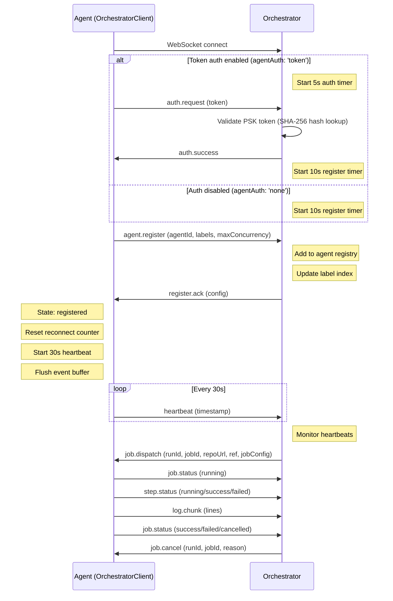

Both the orchestrator (connecting upstream to KiCI) and the agent (connecting to the orchestrator) implement automatic reconnection with exponential backoff and event buffering. This page documents the agent↔orchestrator connection in full.

## Connection lifecycle: orchestrator-agent

The agent connects outbound to the orchestrator's WebSocket endpoint. When agent authentication is enabled (`agentAuth: 'token'`), the agent must first authenticate with a PSK token before registering. The agent sends `agent.register` and waits for a `register.ack` response from the orchestrator before transitioning to the `registered` state.



> See `packages/agent/src/ws/orchestrator-client.ts` for the `OrchestratorClient` implementation.

**Connection states:** `disconnected` -> `connecting` -> `authenticating` (if token auth) -> `registering` -> `registered`

**Key behaviors:**

- When token auth is enabled: first message must be `auth.request` within 5 seconds (code `4002` AUTH_TIMEOUT), then `agent.register` within 10 seconds
- When auth is disabled: first message must be `agent.register` within 10 seconds (code `4002` AUTH_TIMEOUT)
- Orchestrator sends `register.ack` with confirmed configuration after registration
- Agent transitions to `registered` state upon receiving `register.ack`
- Heartbeats start after `register.ack` is received
- Event and log buffers flush after `register.ack` is received
- Status messages (`job.status`, `step.status`) use `sendDirect()` (bypasses both buffers)
- Log lines go through `streamLog()` into a dedicated `LogBuffer` (separate from the protocol `EventBuffer`)

## Reconnection strategy

Both layers use the same exponential backoff algorithm with jitter, implemented as a shared `getReconnectDelay()` function in `@kici-dev/shared`.

**Parameters:**

| Parameter        | Value                               |
| ---------------- | ----------------------------------- |
| Initial delay    | 1,000 ms                            |
| Multiplier       | 1.5x per attempt                    |
| Jitter           | 0-50% additional randomness         |
| Maximum delay    | 60,000 ms (60 seconds)              |
| Maximum attempts | Unlimited (reconnects indefinitely) |

**Formula:**

```
delay = min(baseDelay * multiplier^attempts * (1.0 + random * 0.5), maxDelay)
```

Where `random` is uniformly distributed between 0 and 1.

**Example progression:**

| Attempt | Base delay | With jitter (range) |
| ------- | ---------- | ------------------- |
| 0       | 1,000 ms   | 1,000 - 1,500 ms    |
| 1       | 1,500 ms   | 1,500 - 2,250 ms    |
| 2       | 2,250 ms   | 2,250 - 3,375 ms    |
| 3       | 3,375 ms   | 3,375 - 5,062 ms    |
| 5       | 7,593 ms   | 7,593 - 11,390 ms   |
| 10      | 57,665 ms  | 57,665 - 60,000 ms  |
| 11+     | 60,000 ms  | 60,000 ms (capped)  |

The reconnect counter resets to 0 on successful upstream authentication or agent registration.

> See `packages/shared/src/reconnect-delay.ts` for the shared implementation.

**Reconnection triggers:**

- WebSocket `close` event (unless intentional disconnect)
- WebSocket `error` event (closes the connection, then `close` triggers reconnect)
- Auth failure (server closes connection, reconnect scheduled)

**Reconnection does not trigger on:**

- Intentional disconnect (graceful shutdown via `disconnect()`)
- Normal closure code 1000 initiated by the client

## Event buffering

During disconnection, messages are buffered in memory and flushed in order on reconnect. Both layers use the same `EventBuffer` pattern: a wrapper around `RingBuffer` from `@kici-dev/shared` with bounded capacity and oldest-first overflow.

### Orchestrator upstream EventBuffer

The orchestrator's upstream connection buffers execution events and log chunks during disconnection (10,000-message ring buffer, oldest-first overflow), flushes them after the upstream auth handshake completes, and bypasses the buffer for protocol ACKs that must be sent only when the link is up.

### OrchestratorClient buffers (Agent to Orchestrator)

The agent uses two separate buffers:

**EventBuffer** (protocol messages):

| Property               | Value                                             |
| ---------------------- | ------------------------------------------------- |
| Maximum size           | 5,000 messages                                    |
| Overflow behavior      | Oldest message dropped (via `RingBuffer`)         |
| Flush trigger          | After `register.ack` received                     |
| Bypass mechanism       | `sendDirect()` for status messages (not buffered) |
| Message types buffered | `job.heartbeat` and other protocol messages       |

**LogBuffer** (log lines):

| Property               | Value                                  |
| ---------------------- | -------------------------------------- |
| Maximum size           | 10,000 lines                           |
| Overflow behavior      | Oldest line dropped (via `RingBuffer`) |
| Flush trigger          | After `register.ack` received          |
| Message types buffered | Log lines from step execution          |

Status messages (`job.status`, `step.status`) use `sendDirect()` and bypass both buffers. Log lines go through `streamLog()` into the dedicated `LogBuffer`, not the `EventBuffer`.

> See `packages/agent/src/ws/event-buffer.ts` for the implementation.

### Buffer overflow behavior

When the buffer reaches its maximum size:

1. The oldest message is removed by the `RingBuffer` (FIFO eviction)
2. The new message is appended
3. The `add()` method returns `false` to indicate overflow

This is a deliberate trade-off: recent messages are more valuable than old ones (a log line from 30 seconds ago is more useful than one from 5 minutes ago).

## Heartbeat monitoring

Both layers use periodic heartbeats to detect stale connections. The client sends heartbeats; the server monitors them.

### Orchestrator upstream heartbeats

The orchestrator sends a 30-second heartbeat upstream to KiCI; if the upstream side stops seeing heartbeats it marks the connection unhealthy at 90 seconds and closes it with code 4004 (HEARTBEAT_TIMEOUT) at 180 seconds.

### Orchestrator-Agent Heartbeats

| Parameter     | Value                      | Source                                   |
| ------------- | -------------------------- | ---------------------------------------- |
| Send interval | 30 seconds                 | `OrchestratorClient.heartbeatIntervalMs` |
| Monitor       | Orchestrator agent handler | `updateHeartbeat()` in registry          |

The orchestrator updates the agent's `lastHeartbeatAt` timestamp in the agent registry when a heartbeat is received. The agent handler uses this for connection health tracking.

> See `packages/orchestrator/src/ws/agent-handler.ts` for heartbeat handling.

## Auth timeout

Both layers enforce timeouts on initial messages after connection:

| Layer        | Phase           | Timeout    | Required message | Close code          |
| ------------ | --------------- | ---------- | ---------------- | ------------------- |
| Orchestrator | Auth (if token) | 5 seconds  | `auth.request`   | 4002 (AUTH_TIMEOUT) |
| Orchestrator | Registration    | 10 seconds | `agent.register` | 4002 (AUTH_TIMEOUT) |

If the required message is not received within the timeout, the server closes the connection. The client detects the close and schedules a reconnect via the exponential backoff algorithm.

## Re-registration after reconnect

When a connection is re-established after a disconnection:

**Agent reconnects to Orchestrator:**

1. New WebSocket connection opened
2. If token auth enabled: agent sends `auth.request` with PSK token, orchestrator validates and responds with `auth.success`
3. Agent sends `agent.register` with the same `agentId`, `labels`, and `maxConcurrency`
4. Orchestrator updates the registry entry (re-registration), sends `register.ack`
5. Agent resets reconnect counter, starts heartbeat
6. Event buffer flushed (all buffered `log.chunk` messages sent)
7. In-progress jobs on the agent continue executing -- status updates resume on reconnect

## Failure scenarios

### Upstream KiCI restarts

| Aspect         | Behavior                                                                                          |
| -------------- | ------------------------------------------------------------------------------------------------- |
| Detection      | Orchestrator receives WebSocket `close` event                                                     |
| Buffering      | Execution events and log chunks buffered (up to 10,000)                                           |
| Reconnect      | Automatic via exponential backoff                                                                 |
| Webhook impact | Webhook deliveries during downtime return HTTP 500 to the provider; provider retry policy applies |
| Data loss risk | If buffer overflows during extended outage, oldest events dropped                                 |

### Orchestrator restarts

| Aspect           | Behavior                                                                                                                                                                               |
| ---------------- | -------------------------------------------------------------------------------------------------------------------------------------------------------------------------------------- |
| Detection        | Agent receives WebSocket `close` event                                                                                                                                                 |
| Buffering        | Log chunks and events buffered (up to 5,000 events, 10,000 log lines) with gap markers on flush                                                                                        |
| Reconnect        | Automatic via exponential backoff                                                                                                                                                      |
| In-progress jobs | Enter `recovering` state with per-job recovery timers (grace period = 2x max reconnect delay). Agent reconnects with in-flight job list, orchestrator reconciles and restores tracking |
| Status updates   | Buffered with gap markers. On reconnect, gap marker inserted showing outage duration and buffered message counts, then buffer flushed                                                  |
| Recovery timeout | If agent does not reconnect within grace period (default 120s), jobs permanently failed with error: "Job failed: agent lost during orchestrator restart (recovery timeout exceeded)"   |
| Upstream impact  | The orchestrator drops its upstream connection during the restart and re-authenticates on startup.                                                                                     |

### Network partition (temporary)

| Aspect         | Behavior                                                            |
| -------------- | ------------------------------------------------------------------- |
| Detection      | Heartbeat timeout triggers close (90s unhealthy, 180s close)        |
| Buffering      | Both sides buffer messages during partition                         |
| Recovery       | Auto-reconnect after partition resolves                             |
| Duration limit | No hard limit -- reconnects indefinitely with backoff capped at 60s |

### Agent disconnect during job execution

| Aspect           | Behavior                                                                                                                                                                             |
| ---------------- | ------------------------------------------------------------------------------------------------------------------------------------------------------------------------------------ |
| Detection        | Orchestrator receives WebSocket `close` event for the agent                                                                                                                          |
| Job fate         | Jobs enter `recovering` state with per-job recovery timers. If agent reconnects within grace period (2x max reconnect delay), jobs resume. If not, jobs fail with timeout error      |
| Recovery         | Agent reports in-flight jobs via `inFlightJobs` on `agent.register`. Orchestrator reconciles against DB state, cancels timers, restores tracking                                     |
| Timeout behavior | Grace period expiry permanently fails jobs with: "Job failed: agent lost during orchestrator restart (recovery timeout exceeded)". Scaler notified to avoid spinning up replacements |
| Log continuity   | Buffered logs replayed with gap marker showing outage duration and buffer stats. Original timestamps preserved                                                                       |

> See `packages/orchestrator/src/agent/dispatcher.ts` (`onAgentDisconnect`, `reconcileRecovery`) for the recovery timer behavior and [Agent Reconnection and Job Recovery](agent-reconnection.md) for the full protocol.

### Auth failure on reconnect

| Aspect        | Behavior                                                                      |
| ------------- | ----------------------------------------------------------------------------- |
| Cause         | API key rotated, revoked, or expired during disconnection                     |
| Detection     | `auth.failure` message received from the upstream tier                        |
| Behavior      | Connection closed, reconnect scheduled                                        |
| Resolution    | Reconnect will continue retrying indefinitely (operator must fix credentials) |
| Buffer impact | Messages remain buffered during auth failure retry loop                       |

## See also

- [Agent Reconnection and Job Recovery](agent-reconnection.md) -- full recovery protocol, state machine extension, gap markers, failure modes
- [Job Execution Lifecycle](../execution/job-execution.md) -- how agents execute jobs (status reporting, log streaming)
- [Protocol Messages](../protocol-messages.md) -- message schemas for auth, heartbeat, and relay
- [Webhook Delivery Flow](../webhooks/webhook-delivery.md) -- end-to-end webhook trace including relay
- [Orchestrator Configuration](../configuration.md) -- orchestrator upstream client settings
- [Agent Configuration](../configuration.md) -- agent WebSocket and buffer settings
