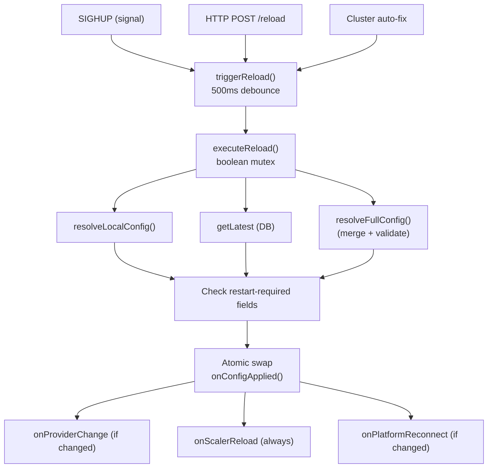

This document describes the internal design of the orchestrator's configuration management system. For operator-facing documentation, see [Configuration Reference](../operator/orchestrator/configuration.md) and [Config Management Guide](../operator/orchestrator/config-management.md).

## Config type system

The configuration is modeled as three distinct types that merge into a final application config:

### LocalConfig

Per-orchestrator settings loaded from a YAML file. These are instance-specific and never shared:

```typescript
interface LocalConfig {
  database: { url: string };
  instance?: { id?: string; mode?: 'platform' | 'hybrid' | 'independent' };
  server?: { port?: number; basePath?: string; logLevel?: string };
  scaler?: { configPath?: string; configDir?: string };
}
```

**Key property:** Every field except `database.url` is optional. An orchestrator can run entirely from env vars with no YAML file.

### SharedConfig

Shared settings stored in the PostgreSQL `config_versions` table. Defined once, shared across all instances:

```typescript
interface SharedConfig {
  platform?: { url?: string; token?: string };
  storage?: { type?: 's3'; bucket?: string; ... };
  agentAuth?: 'token' | 'none';
  agentTokenTtlMs?: number;
  queue?: { maxDepth?: number; timeoutMs?: number };
  lockfileCache?: { max?: number; ttlMs?: number };
  staleDetector?: { scanIntervalMs?: number; ... };
  secrets?: { key?: string; keyFile?: string; bootstrapAdminToken?: string };
  pgCustomerSecrets?: boolean;
  cluster?: { joinToken?: string; raftElectionTimeoutMinMs?: number; ... };
  // ... tuning fields
}
```

**Key property:** All top-level fields are optional. The DB may store a partial config.

### AppConfig

The merged result type used throughout the codebase. Combines `LocalConfig` + `SharedConfig` with resolved defaults:

```typescript
interface AppConfig {
  instanceId: string; // From local config or auto-generated
  mode: 'platform' | 'hybrid' | 'independent';
  databaseUrl: string; // Flattened from database.url
  port: number; // Flattened from server.port
  basePath: string;
  platformUrl?: string; // Flattened from platform.url
  platformToken?: string;
  agentAuth: 'token' | 'none'; // With defaults applied
  queueMaxDepth: number; // Flattened from queue.maxDepth
  cluster: { instanceId: string; credentialFile: string; autoRotateCredentials: boolean; peers: string[]; ... };
  // ... all other fields with defaults
}
```

**Key property:** `AppConfig` uses flat field names (e.g., `databaseUrl` instead of `database.url`) for backward compatibility with the existing codebase. A `flattenToAppConfig()` function handles the mapping.

### How they merge

```
defaults (getDefaults())
    |
    v
SharedConfig (from DB)        ──deepMerge──>  merged layer 1+2
    |
    v
LocalConfig (from YAML)       ──deepMerge──>  merged layer 1+2+3
    |
    v
Env var overrides              ──apply──>      merged layer 1+2+3+4
    |
    v
flattenToAppConfig()           ──flatten──>    flat AppConfig shape
    |
    v
appConfigSchema.safeParse()    ──validate──>   typed AppConfig
```

The `deepMerge` function merges objects recursively, replaces arrays (does not merge item-by-item), and skips `undefined`/`null` source values (they do not override existing values).

## Resolution chain

### Two-phase design

```
Phase 1 (local-only):
  YAML file + KICI_ env vars
      |
      v
  resolveLocalConfig() -> { databaseUrl, instanceId, port, mode }
      |
      v
  Connect to PostgreSQL
      |
      v
Phase 2 (full merge):
  defaults -> DB -> YAML -> env
      |
      v
  resolveFullConfig() -> AppConfig
```

**Why two phases?** The database URL must come from local config (YAML or env var) because we need it to connect to PostgreSQL. But the shared config is stored in PostgreSQL. This circular dependency is broken by resolving local config first (Phase 1), connecting to the DB, then doing the full merge (Phase 2).

### Env var processing

Environment variables are processed in two stages:

1. **Direct mappings:** `KICI_DATABASE_URL` -> `database.url`, etc. A lookup table in `env-overlay.ts` maps known env var suffixes to config path arrays.

2. **Multi-app GitHub provider:** `KICI_PROVIDERS_GITHUB_<APP_NAME>_<FIELD>` is parsed by stripping the `PROVIDERS_GITHUB_` prefix, finding the field suffix (`APP_ID`, `PRIVATE_KEY`, `WEBHOOK_SECRET`), and deriving the app name from the middle segment. App names are lowercased with underscores converted to hyphens (`MAIN_ORG` -> `main-org`).

Type coercion is applied based on known field types: numeric fields are parsed as numbers, boolean fields are compared against `"true"`, all others remain strings.

## Two-phase bootstrap

```
┌─────────────────┐
│  Process Start   │
└────────┬────────┘
         │
         ▼
┌─────────────────┐
│  Load YAML +    │  resolveLocalConfig()
│  Env Overrides  │  -> databaseUrl, instanceId, port, mode
└────────┬────────┘
         │
         ▼
┌─────────────────┐
│  Connect to     │  PostgreSQL
│  Database       │  Run migrations
└────────┬────────┘
         │
         ▼
┌─────────────────┐
│  Load Shared    │  SharedConfigStore.getLatest()
│  Config from DB │  -> decrypt -> SharedConfig
└────────┬────────┘
         │
         ▼
┌─────────────────┐
│  Full Merge     │  resolveFullConfig(local, db, env)
│  + Validate     │  -> AppConfig
└────────┬────────┘
         │
         ▼
┌─────────────────┐
│  Start Server   │  HTTP, WS, scaler, cluster
└─────────────────┘
```

## DB schema

### config_versions table

```sql
CREATE TABLE config_versions (
  id UUID PRIMARY KEY DEFAULT gen_random_uuid(),
  version SERIAL NOT NULL UNIQUE,
  config JSONB NOT NULL,
  created_at TIMESTAMPTZ NOT NULL DEFAULT NOW(),
  created_by TEXT NOT NULL,
  description TEXT,
  encrypted_paths TEXT[] NOT NULL DEFAULT '{}'
);

CREATE INDEX idx_config_versions_version ON config_versions(version DESC);
CREATE INDEX idx_config_versions_created_at ON config_versions(created_at DESC);
```

**Design choices:**

- **SERIAL version:** Auto-incrementing integer provides a total ordering of config changes. Simple to compare in heartbeats.
- **JSONB config:** Stores the full shared config document. JSONB allows future querying/indexing if needed, though we always read the full document.
- **Immutable rows:** Each change creates a new version. Old versions are never modified, providing a full audit trail.
- **encrypted_paths:** Array of concrete dot-separated paths (e.g., `platform.token`, `cluster.joinToken`) that contain encrypted values. Stored alongside the config so the system knows exactly which fields to decrypt without runtime path list dependency.
- **created_by:** Identifies the source of the change (e.g., `cli:seed`, `api:set`, `api:rollback`).

### Versioning strategy

- Version numbers are auto-incrementing integers managed by PostgreSQL SERIAL
- Rollback creates a new version (copy of target) rather than reverting to the old version number
- Example: versions 1, 2, 3 exist. Rollback to 1 creates version 4 with the content of version 1
- This preserves the audit trail: version 4 records when and why the rollback happened

## Encryption

### Algorithm

AES-256-GCM via the existing `secrets/crypto.ts` module:

- **Key:** 32-byte AES-256 key derived from the master key (`KICI_SECRET_KEY`)
- **IV:** Random 12-byte initialization vector per encryption
- **Auth tag:** 16-byte GCM authentication tag
- **AAD:** `config-field:<path>` (e.g., `config-field:platform.token`) -- binds ciphertext to its specific location
- **Wire format:** base64(IV || AuthTag || Ciphertext)
- **Key version:** Integer stamp for the master-key generation that sealed the row. Every new row is written under the active generation (hydrated from `MAX(key_version)` at startup). `kici-admin rotate-key` bumps the stamp atomically — the decrypt path accepts the current generation, and during the grace window also the previous one (`KICI_SECRET_KEY_OLD`), so historical rows and rollbacks continue to work seamlessly across rotations.

### Sensitive field paths

The following glob patterns define sensitive fields:

```typescript
const SENSITIVE_FIELD_PATHS = [
  'platform.token',
  'secrets.key',
  'secrets.bootstrapAdminToken',
  'cluster.joinToken',
] as const;
```

### Encryption flow

```
Save:
  config -> resolveGlobPaths(SENSITIVE_FIELD_PATHS)
         -> for each concrete path: encrypt(value, key, "config-field:<path>")
         -> store { encrypted_config, encrypted_paths[] }

Load:
  row -> for each path in encrypted_paths: decrypt(value, key, "config-field:<path>")
      -> SharedConfig

Export (redacted):
  row -> decrypt (if master key available) -> replace encrypted_paths values with "***REDACTED***"
```

### Rollback optimization

When rolling back, the target version's encrypted config is copied as-is to the new version. No re-encryption is needed because:

- The same master key applies (all orchestrators share the same key)
- The same AAD applies (paths are identical)
- The `encrypted_paths` array is preserved from the target version

## Hot-Reload

### ConfigReloader design

The `ConfigReloader` class manages the full reload lifecycle:



### Safety guarantees

- **Mutex:** Boolean flag prevents concurrent reloads. Second reload returns `{ success: false, errors: ["Reload already in progress"] }`.
- **Debounce:** Rapid triggers (e.g., multiple SIGHUP signals) are collapsed into a single reload with a 500ms window.
- **Validation before swap:** The new config must pass full schema validation. On failure, the old config is preserved and an error is logged.
- **Restart-required detection:** Fields like `databaseUrl`, `port`, `instanceId` are compared. If changed, the old values are preserved in the applied config and a warning is logged.
- **No crash on failure:** The orchestrator always keeps running with the old config if anything goes wrong during reload.

### Subsystem callbacks

The `ConfigReloader` uses a dependency injection pattern with callbacks for subsystem re-initialization:

| Callback              | When Called                   | Purpose                                                                                      |
| --------------------- | ----------------------------- | -------------------------------------------------------------------------------------------- |
| `onProviderChange`    | Provider config changed       | Reserved callback (providers are now DB-managed via sources table; currently always a no-op) |
| `onScalerReload`      | Always on successful reload   | Reload scaler YAML config                                                                    |
| `onPlatformReconnect` | Platform URL or token changed | Reconnect WS to Platform relay                                                               |
| `onConfigApplied`     | Always on successful reload   | Atomic config reference swap, increment local config version                                 |

### Prometheus metrics

| Metric                          | Type    | Labels                                                                  | Description                           |
| ------------------------------- | ------- | ----------------------------------------------------------------------- | ------------------------------------- |
| `kici_orch_config_reload_total` | Counter | `result` (attempted/success/failed), `source` (sighup/http/cluster/cli) | Config reload attempts and outcomes   |
| `kici_orch_config_version`      | Gauge   | --                                                                      | Current shared config version from DB |

## Multi-Provider

### ProviderRegistry

The `ProviderRegistry` maps routing keys to provider bundles. Each routing key (e.g., `github:12345`) is associated with a `ProviderBundle` containing:

- `WebhookNormalizer` -- normalizes incoming webhooks to a standard format
- `LockFileFetcher` -- fetches lock files from the repository
- `ChangedFilesFetcher` -- determines which files changed
- `CloneTokenProvider` -- generates clone tokens for agents
- `RepoUrlBuilder` -- builds clone URLs and raw file URLs
- `ContributorResolver` -- resolves contributor permissions for trust-tier gating
- `CheckStatusPoster` -- posts check statuses (approval/hold) to the git provider

Provider registrations are managed via the `sources` database table, not via `SharedConfig`. When the orchestrator connects to the Platform relay, it reads source records from the DB and sends `source.register` messages. Changes to sources (add/remove) are detected via PostgreSQL LISTEN/NOTIFY on the `sources_change` channel and pushed to the Platform via `source.secrets` and `source.register`/`source.deregister`.

### Per-App Credentials

Each source record contains its own `appId` and `privateKey` (stored as scoped secrets). When processing a webhook, the orchestrator looks up the routing key to find the matching source and uses its credentials for JWT generation, clone tokens, and check run updates.

## Cluster sync

### Heartbeat config version

In clustered deployments, each orchestrator includes its current config version in Raft heartbeat metadata via the `configVersion` optional field on the `peerHeartbeatSchema`.

When the `PeerRegistry` processes a heartbeat:

1. Compare `localConfigVersion` with `peer.configVersion`
2. If `peer.configVersion > localConfigVersion` AND both are > 0:
   - Invoke the `onConfigVersionBehind` callback
   - This triggers a config reload from the database

### Auto-remediation flow

```
Orchestrator A (version 5)          Orchestrator B (version 3)
         │                                     │
         │──── heartbeat(configVersion=5) ────>│
         │                                     │
         │                           compare: 5 > 3
         │                           trigger reload from DB
         │                                     │
         │                           resolveFullConfig()
         │                           -> version 5
         │                                     │
         │<── heartbeat(configVersion=5) ──────│
         │                                     │
         │   both at version 5 ✓               │
```

### Guard conditions

- Version comparison only triggers when **both** local and peer versions are > 0
- This prevents false triggers from:
  - Legacy orchestrators that do not report `configVersion` (field is optional, defaults to 0)
  - Newly started orchestrators before their first config load
- The `localConfigVersion` is a monotonically incrementing local counter (incremented on each successful reload)

## See also

- [Configuration Reference](../operator/orchestrator/configuration.md) -- operator guide
- [Config Management Guide](../operator/orchestrator/config-management.md) -- CLI and API guide
