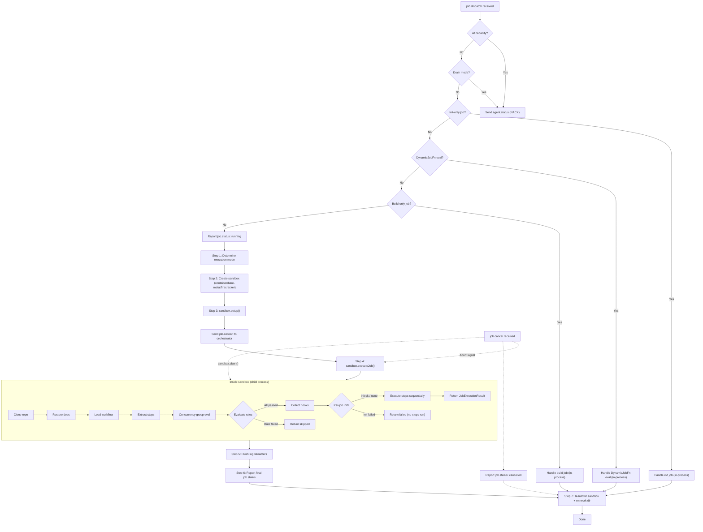

When the orchestrator dispatches a job to an agent, the agent creates an `ExecutionSandbox` (container, bare-metal, or firecracker) and delegates execution to it. The sandbox runs customer code in an isolated child process -- never in the agent's V8 isolate. The sandbox handles cloning, dependency restore, workflow loading, rule evaluation, and step execution. IPC callbacks wire sandbox events (step status, log lines, event emissions) to the agent's WebSocket pipeline. The entire lifecycle is managed by the `JobRunner` class.

> See `packages/agent/src/execution/job-runner.ts` for the top-level orchestration and `packages/agent/src/execution/sandbox/` for sandbox implementations.

## Lifecycle diagram



The agent checks for cancellation (via `AbortController`) before sandbox creation and before execution. If `job.cancel` is received at any point, the sandbox is aborted and the job transitions to the `cancelled` state. Build-only jobs (cache population), init-only jobs (dynamic field resolution), and DynamicJobFn evaluation jobs (runtime job generation) run in-process without a sandbox since they don't execute customer workflow steps.

## Agent-level steps

The agent's `JobRunner.runJob()` manages the outer lifecycle. Customer code never runs in the agent process.

### Step 1: Sandbox selection

The execution mode is determined from the job config and environment (see [Container execution mode](#container-execution-mode) for priority rules). The agent resolves the path to the compiled `workflow-runner.js` entry point and builds a sanitized environment for the sandbox.

### Step 2: Sandbox setup

The agent calls `sandbox.setup()` which prepares the execution environment:

- **Container:** `docker create` + `docker start` with the workflow runner bind-mounted
- **Bare-metal:** Validates paths and environment
- **Firecracker:** VM is already booted by the scaler; agent runs inside

### Step 3: Job context emission

Before sandbox execution, the agent sends a `job.context` message to the orchestrator with runtime details (Node version, OS, arch, sandbox type, working directory, git ref, environment variables). This enables the dashboard Summary tab.

### Step 4: Sandbox execution

The agent calls `sandbox.executeJob()` which delegates to the workflow runner child process. IPC callbacks wire sandbox events to the WebSocket pipeline:

- `onStepStatus` -- forwarded as `step.status` messages
- `onLogLine` -- batched by `LogStreamer` and sent as `log.chunk` messages
- `onEventEmit` -- relayed to orchestrator as `event.emit`, response returned via IPC
- `onConcurrencyReport` -- relayed as `job.concurrency.report`, ack returned via IPC

## Sandbox-internal pipeline

Inside the sandbox child process (workflow runner), the following steps execute sequentially:

### Repository clone

The sandbox performs a shallow `git clone` at the dispatch ref. For private repositories, a GitHub App installation token from `job.dispatch.token` is injected via `http.extraHeader` git config (keeps it out of the clone URL). After clone, `HEAD` is verified against the expected SHA.

**Overlay (test runs only).** For `kici test` runs, the sandbox downloads, decrypts, and applies the developer's uncommitted changes on top of the clone. See [Test run architecture](test-runs.md).

> See `packages/agent/src/checkout/git-clone.ts` for the implementation.

### Source and dependency restore

On execution jobs the sandbox performs exactly two cache fetches:

1. **Source tarball** — downloads the `.kici/` source tarball at `sourceTarUrl` and extracts it into the work directory. No `git clone` happens on the execution path; the source tarball IS the workflow source at the target SHA. Build jobs are the only code path that still clones.
2. **Dependency tarball** — downloads the `node_modules` tarball at `depsUrl` with streaming SHA-256 verification against `depsHash` and extracts it into `.kici/node_modules/`. If `depsUrl` is absent (dep cache miss), the sandbox falls back to inline `npm ci`.

> See [Source and dependency caching flow](../data-flows.md#source-and-dependency-caching-flow) for the full cache architecture.

### Workflow loading

The sandbox registers the shared `@kici-dev/shared/ts-loader-hook` (a Node ESM loader that transforms TypeScript on import) once per process and then dynamic-`import()`s the workflow `.ts` file directly from the extracted source tree. There is no runtime bundler — TypeScript is transformed on import, and transitive imports (`@kici-dev/sdk`, host-repo helpers) resolve against `.kici/node_modules/` via Node's normal ESM lookup.

The lock file's `source.file` and `source.exportName` identify the exact workflow and export to load from the imported module.

> See `packages/agent/src/execution/workflow-loader.ts` and `packages/shared/src/ts-loader-hook.ts` for the implementation.

**Process:**

1. Resolve source file path relative to work directory
2. Register the TS loader hook (idempotent, once per process)
3. Read the raw TS source, compute `contentHash = SHA-256(COMPILE_SCHEMA_VERSION + ":" + normalizeLineEndings(rawSource) [+ "\0" + normalizeLineEndings(assetDigest)])` (with `COMPILE_SCHEMA_VERSION = 5`), and compare to the lock file's expected `contentHash`. The same line-ending normalization is applied by the compiler so an LF-authored lockfile matches a CRLF working tree on Windows hosts (where Git's system gitconfig defaults `core.autocrlf=true`). A mismatch throws a "lock file is out of date" error carrying the baked agent SDK version + bundle hash for debugging.
4. Dynamic-`import()` the `.ts` file (cache-busted with a `?t=<ts>` query) — the loader hook transforms TS on demand.
5. Extract the named workflow from module exports.

### Workflow and step extraction

After loading the module, the sandbox extracts the target workflow by export name and resolves its steps, normalizing bare functions and `step()` calls into a uniform structure. Step names are assigned at **compile time** during lock file generation — unnamed steps receive counter IDs (`step-1`, `step-2`, etc.) in the compiler, not at runtime. Concurrency group evaluation also happens at this stage.

### Rule evaluation

Rules are evaluated sequentially with fail-fast behavior. Each rule's `check` function is called with a `RuleContext` providing the event payload, changed files, environment variables, and a zx `$` shell. Rules can be synchronous or asynchronous.

If any rule check returns `false` (or throws), the job is **skipped** (not failed). The remaining rules are not evaluated. Rule evaluation results (label, passed, duration, error) are included in the `job.status` message data.

> See `packages/agent/src/execution/rule-evaluator.ts` for the implementation.

### Hook collection

The sandbox collects job-level hooks (`beforeStep`, `afterStep`, `onSuccess`, `onFailure`, `onCancel`, `cleanup`) from the loaded workflow module. These hooks are invoked at the appropriate points during step execution — `beforeStep`/`afterStep` around each step, `onSuccess`/`onFailure` after all steps complete, `onCancel` on cancellation, and `cleanup` always runs last.

### Per-job init phase

When a job declares `init` (see [Per-job init](../../user/sdk/core.md#per-job-init)), an init phase runs **after the hooks are collected and before the step loop begins** — provisioning a repo-declared toolchain so it is on the environment every step sees. Each init spec runs through the **same sandbox shell** that steps use (cwd at the clone root, the job's environment, masked log streaming), and each surfaces as an `init:<n>` pseudo-step in the run timeline alongside the step list (mirroring how `hook:*` rows appear).

Typed presets (`'mise'` / `{ mise }`) and `'auto'` detection are expanded into concrete init specs **at the agent init phase**, where the clone root is on disk to hash for the cache key and scan for marker files. A preset registry maps each preset name to an OS-branched expander, and an ordered auto-detect table maps marker files to presets; both produce the same generic init spec the phase below loops over, so the run/cache/env/timeout machinery is unchanged.

For each init spec, in declaration order:

1. **Cache restore** — if the spec sets `cache`, the agent restores the cached paths before the command, so a warm key skips the download.
2. **Run the command** — the init command runs in the sandbox shell against a per-init wall-clock timeout. Before it runs, the agent allocates fresh `$KICI_ENV` / `$KICI_PATH` files and points the shell's environment at them.
3. **Apply the env / PATH delta** — after the command succeeds, the agent reads the `KEY=value` lines from `$KICI_ENV` and the directory lines from `$KICI_PATH`, applies the delta (PATH entries prepended), and the result becomes visible to every subsequent init and step.
4. **Cache save** — if the spec set `cache` and the key missed on restore, the agent saves the cached paths after the command.

If any init exits non-zero or exceeds its timeout, the job **fails before any step runs**: the `init:<n>` pseudo-step is marked failed with its logs attached, the remaining inits and the entire step loop are skipped, and the job reports a terminal failure (a timeout is reported with the distinct timeout reason). This makes a broken toolchain an early, attributable failure rather than a confusing mid-step error.

### Step execution

Steps execute sequentially within a job. Each step receives a full `StepContext` with:

- `$` -- zx shell (runs natively inside the sandbox process, regardless of sandbox type)
- `log` -- step-scoped logger that streams via IPC to the agent, then to the orchestrator
- `env` -- merged environment variables (process env + job env + step env + secrets)
- `ctx` -- workflow and job metadata (names, runsOn label)
- `matrix` -- optional matrix values for the current combination

Each step runs inside a `Promise.race` against a timeout. The timeout is configured per-step (`step.timeout`) or falls back to the agent's default (`KICI_DEFAULT_STEP_TIMEOUT_MS`, default 30 minutes).

> See `packages/agent/src/execution/sandbox/workflow-runner.ts` for the implementation.

**Step lifecycle:**

1. Emit `step.status: running` via IPC (agent forwards to orchestrator)
2. Execute `step.run(ctx)` with timeout enforcement
3. Emit `step.status: success` or `step.status: failed` with duration and diagnostics
4. Return `StepResult` with `continueOnError` flag

**Step failure behavior:**

- If `continueOnError` is `false` (default): job execution stops immediately
- If `continueOnError` is `true`: execution continues to the next step, but the final job status still reflects the failure

**Timeout behavior:**

- Step cancelled via `AbortController` after the configured timeout
- Error message includes step name and timeout duration

## Log streaming

Logs flow from the sandbox child process via IPC to the agent, where the `LogStreamer` batches output lines and sends them to the orchestrator as `log.chunk` WebSocket messages. Each step has its own `LogStreamer` instance, created lazily on first log line.

> See `packages/agent/src/execution/log-streamer.ts` for the implementation.

**What gets captured inside a sandbox step:** the sandbox runs a three-layer capture so that everything a step writes ends up in the step log stream:

1. **Subprocess output** — the step-local zx `$` is configured with a `log` callback (`createSandboxStepContext` in `workflow-runner.ts`) that intercepts every `{ kind: 'stdout' | 'stderr' }` entry zx emits for child processes and forwards each completed line as `log.line`. zx pipes child stdio to an internal `VoidStream`, so without this override subprocess output would be invisible.
2. **Direct console output from step TS/JS code** — `installOutputCapture()` monkey-patches `process.stdout.write` and `process.stderr.write` while a step is active (`captureStepIndex >= 0`). Calls to `console.log`, `console.error`, `console.warn`, or any library that writes directly to `process.stdout`/`stderr` are split into lines and forwarded as `log.line`. The patch is also active during the pre-step `prepare` phase (module load, concurrency-group evaluation, rule evaluation) under `capturePrepareActive = true`, routing output to the workflow-level log bucket (`stepIndex: -1`).
3. **Structured logger** — the step context's `log` object (`log.info` / `log.warn` / `log.error` / `log.debug`) sends `log.line` directly over IPC, bypassing the stdio hooks.

All three paths converge in the agent's per-step `LogStreamer`. Hooks (`beforeStep`, `afterStep`, `onSuccess`, `onFailure`, `onCancel`, `cleanup`) also run under `captureStepIndex` — per-step hooks reuse the step index and land in the step's log; post-loop and cancel-path hooks allocate their own indices above `steps.length` and appear as dedicated step rows in the dashboard.

**What gets captured inside an in-process agent job (`__init__` / `__build__` / `__dynamic__`):** these jobs don't use the sandbox child process; they run in the agent itself. A second capture primitive — `AsyncLocalStorage`-scoped `console.*` patching in `packages/agent/src/execution/console-capture.ts` — routes user-supplied output to a per-job synthetic step-0 `LogStreamer`.

The captured surfaces are:

- `console.log` / `console.error` / `console.warn` / `console.info` / `console.debug` from module top-level code.
- Dynamic `environment` / `env` / `concurrencyGroup` functions.
- The `DynamicJobFn` body and generated-job `env` / matrix functions.
- Subprocess output from the per-invocation zx `$` callback installed on the `DynamicJobFn` path:

  ```ts
  await $`echo hello`; // captured via the zx log callback
  ```

The patch targets only `console.*` methods (not `process.stdout.write`) because the agent's structured logger writes directly to stdout. Capturing stdout at the agent level would leak agent-internal log output into user step streams.

**What is still not captured:**

- **Direct `process.stdout.write` or `printf` inside in-process jobs** — use `console.*` or the provided `log` parameter instead.
- **Output outside a capture scope** — in the sandbox this means any IPC or setup code that runs before `installOutputCapture()` returns; in the agent this means anything on an async stack not descended from a `runCaptured(...)` call.

**Flush triggers:**

- Line count reaches threshold (default: 50 lines)
- Timer fires (default: 100ms)
- Step completes (explicit flush)

**Size limit:**

- Maximum log size per step is controlled by `maxLogSizeBytes` from the job dispatch message, falling back to `KICI_MAX_LOG_SIZE_BYTES` (default: 10 MB)
- After exceeding the limit, a `[TRUNCATED: log output exceeded <maxLogSizeBytes> bytes]` notice is sent and further lines are silently dropped

**Message format:**

```
log.chunk {
  messageId, runId, jobId, stepIndex,
  lines: string[],
  timestamp
}
```

Log chunks are sent via the buffered `send()` path (not `sendDirect()`), so they participate in event buffering during disconnection.

## Status reporting

The agent reports status at each lifecycle point using `sendDirect()`, which bypasses the event buffer to ensure protocol messages are delivered immediately when the connection is available. Log chunks use the buffered `send()` path to participate in event buffering during disconnection.

| Message                       | When                                 | Key data                              |
| ----------------------------- | ------------------------------------ | ------------------------------------- |
| `job.status: running`         | Job starts                           | runId, jobId                          |
| `job.context`                 | Before sandbox execution             | runtime, sandboxType, envVars         |
| `job.heartbeat`               | Periodic during execution            | runId, jobId, timestamp               |
| `step.status: running`        | Each step starts (via IPC)           | stepIndex, stepName                   |
| `step.status: success/failed` | Each step completes (via IPC)        | durationMs, exitCode, signal          |
| `log.chunk`                   | During execution (via IPC)           | lines (batched)                       |
| `job.status: success`         | All steps pass                       | durationMs, stepResults               |
| `job.status: failed`          | Any step fails                       | durationMs, stepResults, error        |
| `job.status: cancelled`       | Abort signal                         | --                                    |
| `job.status: success`         | Rule check fails (all steps skipped) | durationMs, stepResults (all skipped) |

## Cleanup

After execution completes (regardless of outcome), the sandbox is torn down via `sandbox.teardown()`, the work directory is removed via `fs.rm()` with `recursive: true, force: true`, and the active job slot is freed from the `JobRunner.activeJobs` map.

Cleanup runs in a `.finally()` block to ensure it executes even if the job throws an unexpected error.

## Container execution mode

The execution mode is determined at the **job level** (not per-step) by the `JobRunner` using the following priority:

1. Container config in job dispatch → `container`
2. `KICI_EXECUTION_MODE` env var → explicit override
3. `KICI_SCALER_MANAGED=1` with Firecracker detection → `firecracker`
4. Default → `bare-metal`

When running in container mode, the agent uses the `ContainerSandbox`. The workflow runner is bind-mounted read-only into the container, and IPC uses stdin/stdout JSON-lines via dockerode's exec API.

> See `packages/agent/src/execution/sandbox/container-sandbox.ts` for the implementation.

**Container lifecycle:**

1. **Create container** -- `docker create` with workflow runner bind-mounted at `/opt/kici/workflow-runner.js`, pre-sanitized environment variables, and `sleep infinity` as the entrypoint to keep the container alive
2. **Start container** -- `docker start`
3. **Execute job** -- `docker exec` runs the workflow runner inside the container; the runner handles clone, deps, compile, and step execution within the container
4. **Cleanup** -- `docker rm -f` after job completes

**Important:** With the sandbox model, the entire workflow runner process (including step TypeScript code and shell commands via `$`) runs inside the container. Agent-internal credentials (`KICI_*`, `KICI_DATABASE_URL`, etc.) never enter the container -- only pre-sanitized environment variables are passed through.

**Debug mode:** When `KICI_DOCKER_KEEP_FAILED=true`, failed job containers are preserved for debugging instead of being removed.

## Concurrency control

The agent enforces single-job concurrency: only one job runs at a time. When a `job.dispatch` arrives and the agent is already running a job, the dispatch is rejected by sending an `agent.status` message back to the orchestrator. The orchestrator then queues the job and re-dispatches when the agent reports available capacity.

> See `packages/agent/src/server.ts` for the concurrency gating logic.

**Capacity flow:**

1. `job.dispatch` arrives
2. Check `jobRunner.activeJobs.size > 0`
3. If already running: send `agent.status` with current `activeJobs` count
4. If idle: accept and execute
5. On job completion: send `agent.status` with updated counts

## Cancellation

When the orchestrator sends `job.cancel`, the agent:

1. Looks up the job in `activeJobs` by `jobId`
2. Calls `abortController.abort(reason)` on the active job
3. The running phase detects the abort signal at the next check point
4. If a step is mid-execution, the step's process receives SIGTERM
5. After the grace period (default 30s for bare-metal/firecracker, 10s for container), the agent force-kills with SIGKILL
6. Reports `job.status: cancelled`
7. Cleans up work directory

> See `packages/agent/src/server.ts` for the SIGTERM/SIGUSR1 shutdown handlers.

**Drain mode (SIGUSR1):**

The agent supports a drain mode for graceful scaling down. When `SIGUSR1` is received:

1. Stop accepting new job dispatches
2. Wait for all active jobs to complete (polls every 1 second)
3. Stop metrics reporter (final metrics flush)
4. Disconnect from orchestrator
5. Stop HTTP server
6. Exit

## See also

- [Reconnection and event buffering](../clustering/reconnection.md) -- WebSocket reconnection behavior during agent disconnection
- [Protocol messages](../protocol-messages.md) -- message schemas for job.dispatch, job.status, log.chunk
- [State machine](state-machine.md) -- execution state transitions (pending, running, success, failed)
- [Agent configuration](../../operator/agent/configuration.md) -- environment variables for the agent
- [Agent getting started](../../operator/agent/getting-started.md) -- deployment guide
