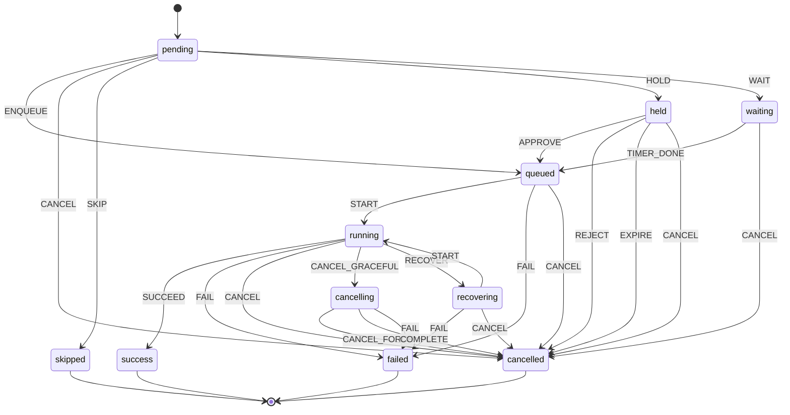

## Overview

The state machine tracks workflow runs, jobs, and steps through a consistent lifecycle. It is a pure-function implementation with no internal state -- given a current state and an event, it deterministically returns the next state or rejects the transition.

The same state machine is used across all tiers: the orchestrator tracks run and job states during dispatch, while the agent transitions job and step states during execution. Both import from `@kici-dev/engine`.

> Source: `packages/engine/src/state-machine/`

## States

The state machine defines 11 states. Seven are transient (the entity is still in progress) and four are terminal (the entity has reached a final outcome).

| State        | Description                                                    | Terminal |
| ------------ | -------------------------------------------------------------- | -------- |
| `pending`    | Initial state. Waiting for processing.                         | No       |
| `queued`     | Enqueued for execution. Waiting for an agent.                  | No       |
| `running`    | Actively executing.                                            | No       |
| `recovering` | Temporarily disconnected. Waiting for reconnection or timeout. | No       |
| `cancelling` | Graceful cancellation in progress. Running cancel hooks.       | No       |
| `held`       | Held for approval (protection rule: required reviewers).       | No       |
| `waiting`    | Waiting for timer expiry (protection rule: wait timer).        | No       |
| `success`    | Completed successfully.                                        | Yes      |
| `failed`     | Completed with failure.                                        | Yes      |
| `cancelled`  | Cancelled before or during execution.                          | Yes      |
| `skipped`    | Skipped due to rule evaluation or dependency.                  | Yes      |

> Source: `packages/engine/src/state-machine/types.ts` -- `ExecutionState` type and `TERMINAL_STATES` constant.

## Events

The state machine responds to 16 events. Each event represents an action that moves the entity from one state to another.

| Event             | Description                                                     |
| ----------------- | --------------------------------------------------------------- |
| `ENQUEUE`         | Move from pending to queued.                                    |
| `START`           | Begin execution (or resume from recovering).                    |
| `SUCCEED`         | Mark as successfully completed.                                 |
| `FAIL`            | Mark as failed.                                                 |
| `CANCEL`          | Cancel the execution (immediate, no hooks).                     |
| `CANCEL_GRACEFUL` | Begin graceful cancellation (run cancel hooks before stopping). |
| `CANCEL_FORCE`    | Force cancellation of a gracefully-cancelling execution.        |
| `COMPLETE`        | Cancel hooks finished; complete the cancellation.               |
| `SKIP`            | Skip the execution (rule or dependency).                        |
| `RECOVER`         | Enter recovery mode (e.g., agent disconnect).                   |
| `HOLD`            | Hold for approval (protection rule enforcement).                |
| `APPROVE`         | Approve a held run (reviewer action).                           |
| `REJECT`          | Reject a held run (reviewer action).                            |
| `EXPIRE`          | Hold period expired without approval.                           |
| `WAIT`            | Enter wait timer (protection rule enforcement).                 |
| `TIMER_DONE`      | Wait timer expired, proceed to queued.                          |

> Source: `packages/engine/src/state-machine/types.ts` -- `ExecutionEvent` type.

## State diagram



## Transition table

All 25 valid transitions. Any transition not listed here will throw an `InvalidTransitionError`.

| Current State | Event             | Next State   |
| ------------- | ----------------- | ------------ |
| `pending`     | `ENQUEUE`         | `queued`     |
| `pending`     | `CANCEL`          | `cancelled`  |
| `pending`     | `SKIP`            | `skipped`    |
| `pending`     | `HOLD`            | `held`       |
| `pending`     | `WAIT`            | `waiting`    |
| `held`        | `APPROVE`         | `queued`     |
| `held`        | `REJECT`          | `cancelled`  |
| `held`        | `EXPIRE`          | `cancelled`  |
| `held`        | `CANCEL`          | `cancelled`  |
| `waiting`     | `TIMER_DONE`      | `queued`     |
| `waiting`     | `CANCEL`          | `cancelled`  |
| `queued`      | `START`           | `running`    |
| `queued`      | `FAIL`            | `failed`     |
| `queued`      | `CANCEL`          | `cancelled`  |
| `running`     | `SUCCEED`         | `success`    |
| `running`     | `FAIL`            | `failed`     |
| `running`     | `CANCEL`          | `cancelled`  |
| `running`     | `CANCEL_GRACEFUL` | `cancelling` |
| `running`     | `RECOVER`         | `recovering` |
| `cancelling`  | `CANCEL_FORCE`    | `cancelled`  |
| `cancelling`  | `COMPLETE`        | `cancelled`  |
| `cancelling`  | `FAIL`            | `failed`     |
| `recovering`  | `START`           | `running`    |
| `recovering`  | `FAIL`            | `failed`     |
| `recovering`  | `CANCEL`          | `cancelled`  |

**Key patterns:**

- `CANCEL` is valid from six transient states (pending, queued, running, recovering, held, waiting). The `cancelling` state uses `CANCEL_FORCE` instead.
- `CANCEL_GRACEFUL` is only valid from running — it enters the `cancelling` state where cancel hooks run before the entity reaches `cancelled`.
- From `cancelling`, `CANCEL_FORCE` or `COMPLETE` resolve to `cancelled`, and `FAIL` resolves to `failed` (hook failure).
- `FAIL` is valid from queued (e.g., agent crash before execution starts), running, cancelling (hook failure), and recovering (e.g., recovery timeout).
- `SKIP` is only valid from pending (before any processing begins).
- `SUCCEED` is only valid from running (must have started execution).
- `RECOVER` is only valid from running (agent disconnect during execution). From recovering, `START` resumes execution.
- `HOLD` and `WAIT` are only valid from pending (protection rules are evaluated before dispatch).
- `APPROVE`, `REJECT`, and `EXPIRE` are only valid from held. `TIMER_DONE` is only valid from waiting.
- Both held and waiting resolve to queued on success (APPROVE/TIMER_DONE), re-entering the normal execution flow.

## Terminal States

Four states are terminal: `success`, `failed`, `cancelled`, and `skipped`. Once a state machine entity reaches a terminal state, it is immutable -- no further transitions are possible.

Terminal states have no entries in the transition table (empty objects). Attempting to apply any event to a terminal state throws an `InvalidTransitionError`.

The `TERMINAL_STATES` constant is exported from `packages/engine/src/state-machine/types.ts` for runtime checks.

## API Reference

The state machine exports 2 public functions via `packages/engine/src/state-machine/index.ts`. Both are pure -- they take inputs and return outputs with no side effects or internal state.

> Source: `packages/engine/src/state-machine/machine.ts`

### `transition(state, event)`

```typescript
function transition(state: ExecutionState, event: ExecutionEvent): ExecutionState;
```

Applies an event to a state and returns the new state. Throws `InvalidTransitionError` if the transition is not valid.

### `isTerminal(state)`

```typescript
function isTerminal(state: ExecutionState): boolean;
```

Returns `true` if the state is terminal (`success`, `failed`, `cancelled`, or `skipped`). Returns `false` for transient states (`pending`, `queued`, `running`, `recovering`, `cancelling`, `held`, `waiting`).

### Internal functions (not exported)

The following are defined in `machine.ts` but not re-exported from the module index:

- `canTransition(state, event)` -- checks whether a transition is valid without throwing
- `validEvents(state)` -- returns valid events for a given state
- `InvalidTransitionError` -- thrown when an invalid transition is attempted

### `InvalidTransitionError` (internal)

```typescript
class InvalidTransitionError extends Error {
  readonly state: ExecutionState;
  readonly event: ExecutionEvent;
}
```

Thrown by `transition()` when an invalid transition is attempted. Carries the `state` and `event` that caused the error for programmatic error handling. This class is not re-exported from the public module index — callers should catch generic `Error` instances instead.

## Usage Across Tiers

### Orchestrator

The orchestrator uses the state machine to track run and job states during the dispatch pipeline. When a webhook arrives, the orchestrator creates a run in `pending` state, transitions matched jobs through `queued`, and tracks status updates from agents.

### Agent

The agent uses the state machine to transition job and step states during execution. A job starts as `pending`, moves to `running` when execution begins, and reaches a terminal state (`success`, `failed`, `cancelled`) based on the outcome. Steps follow the same lifecycle independently.

Both tiers import the state machine from `@kici-dev/engine`, ensuring consistent transition logic across the system.

## See also

- [Architecture Overview](../overview.md) -- three-tier model and package relationships
- [Protocol Messages](../protocol-messages.md) -- job.status and step.status messages carry state values
- [Job Execution](job-execution.md) -- how the agent transitions states during job lifecycle
