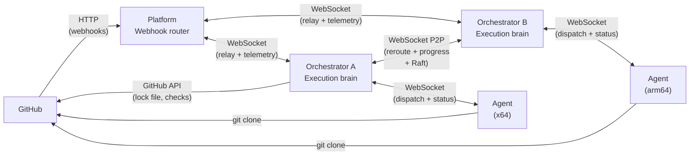
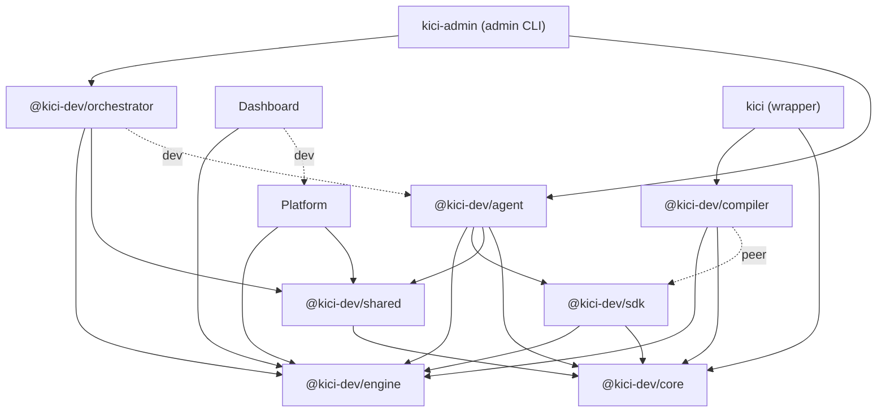

KiCI uses a three-tier relay model that separates webhook routing from code execution. Customer code never leaves customer infrastructure -- the Platform tier handles only webhook verification and routing, while the orchestrator and agent tiers run on customer-managed servers.

## Three-tier relay model

The system is organized into three deployment tiers connected by WebSocket channels:

**Why three tiers?** Trust boundaries. The Platform relay never sees customer code -- it only verifies webhook signatures and forwards payloads. The orchestrator matches triggers against the lock file without cloning repositories. Only the agent, running on customer infrastructure, clones code and executes steps.

This model also enables fully self-hosted deployment: all three tiers can run on customer infrastructure, with the Platform tier receiving webhooks directly from GitHub.

## Component responsibilities

### Platform

The Platform is KiCI's hosted, multi-tenant control plane. It provides the hosted dashboard (run listing, run detail, live log streaming, settings), identity and authentication (OIDC, personal access tokens, API keys, JWTs), multi-tenant organization / team / role-based access management, billing, and webhook ingestion -- verifying inbound signatures (HMAC-SHA256, timing-safe) and relaying payloads to the correct orchestrator over WebSocket. It aggregates execution telemetry and status forwarded by orchestrators, registers sources, and matchmakes peers for clustering.

The Platform never processes, stores, or executes customer code, and never sees customer secrets. It routes webhook payloads and aggregates execution status; the code itself only ever lives on the customer's orchestrator and agent tiers. In the execution path the Platform is deliberately thin -- it does not run jobs -- but functionally it is a full platform, not merely a relay. The hosted Platform is EU-sovereign.

### Orchestrator (`@kici-dev/orchestrator`)

The orchestrator is the execution brain. It decides what to run and dispatches work to agents.

- **Trigger matching** -- Evaluates lock file triggers against webhook payloads to determine which jobs to run. Uses branch, path, and event matching via picomatch.
- **Lock file caching** -- Fetches `kici.lock.json` from the configured provider's API (GitHub, generic webhook, universal-git, or internal). An LRU cache wraps the per-provider fetcher, keyed by `{provider}:{repo}:{ref}` so cross-provider fallback resolutions stay isolated.
- **Agent registry** -- Tracks connected agents with label-based routing for job dispatch.
- **Job queue** -- PostgreSQL-backed FIFO queue for reliable dispatch.
- **Webhook pipeline** -- Dedup, event mapping, lock file fetch, trigger matching, and job dispatch in a single pipeline.
- **Multi-orchestrator clustering** -- Optional peer-to-peer coordination via direct WebSocket connections. Enables cross-architecture job routing (e.g., x64 coordinator reroutes arm64 jobs to a peer), high availability, and dedicated coordinator topologies. Uses Raft consensus for leader election (orphan recovery). See [Multi-Orchestrator Architecture](./clustering/multi-orchestrator.md).
- **Auto-scaler** -- Optional pluggable module for ephemeral agent provisioning. Supports containers (Docker/Podman), bare-metal processes, and Firecracker microVMs as backends. Spawns agents on demand when no matching agent is connected, with label-based routing, two-level capacity limits (global + per-backend), warm pools, YAML configuration (`scalers.d/` directory support), and SIGHUP reload. Disabled by default -- orchestrator works without it.
- **Independent database** -- Has its own PostgreSQL database separate from the Platform. Stores execution runs/jobs/steps, dispatch queue, webhook secrets, dedup cache, and scaler state. The orchestrator's `execution_runs` and `execution_jobs` are the authoritative source of truth. The Platform receives execution status updates via WebSocket messages (`execution.status`, `job.status.forward`).

> Source: `packages/orchestrator/src/pipeline/processor.ts` (webhook pipeline), `packages/orchestrator/src/cluster/` (P2P coordination), `packages/orchestrator/src/scaler/` (auto-scaler module), `packages/orchestrator/src/server.ts` (Platform/hybrid entry point)

### Agent (`@kici-dev/agent`)

The agent is the execution worker. It runs on customer infrastructure and has full access to customer code.

- **Repository cloning** -- Clones the target repo with token-based auth (token in HTTP headers, not URLs, to prevent leakage).
- **Step execution** -- Runs steps sequentially with full `StepContext` (zx shell, logger, environment, workflow/job metadata).
- **Docker support** -- Container-based step execution via `docker exec` for isolated environments.
- **Log streaming** -- Chunked log streaming back to the orchestrator with configurable size limits.
- **Graceful shutdown** -- SIGTERM with 10s grace period, SIGUSR1 for drain mode.

> Source: `packages/agent/src/execution/job-runner.ts` (job lifecycle), `packages/agent/src/server.ts` (entry point)

## Supporting packages

### `@kici-dev/engine`

Shared business logic used by all three tiers. Single source of truth for cross-tier concerns. Has no internal `@kici-dev/*` dependencies -- only a handful of third-party libraries.

- Protocol message schemas (Zod-based, direction-specific unions including dashboard REST-over-WS, browser live streaming, the test-relay control plane, log pull, run events, peer-to-peer, cluster join, and source registration)
- Provider interfaces (WebhookNormalizer, LockFileFetcher, ChangedFilesFetcher, CloneTokenProvider, RepoUrlBuilder, ContributorResolver, CheckStatusPoster)
- Trigger matching engine (branch, path, event evaluation)
- Execution state machine (11 states, 16 events, pure functions)
- Webhook signature verification (HMAC-SHA256, timing-safe)
- WebSocket close codes (unified across all tiers)
- WebSocket rate limiting (WsRateLimiter)
- Environment allowlist (safe env var filtering)
- Secrets management (secret context resolution)
- Environment model (scoped secrets, env merge, protection gates)
- Label utilities (platform label derivation, runsOn normalization, `kici:*` set-only reserved namespace, role labels)
- Audit policy and retention (per-action access-log sampling, warm-retention windows for cold-store eligibility, federated activity row schema)
- Scaler backend type enum (`container`, `bare-metal`, `firecracker`, `kubernetes`)
- Registration trigger type enum (registerable trigger discriminator)
- Bundler config (shared bundler configuration consumed by `e2e/helpers/service-deploy.ts`; the agent runtime uses the `@kici-dev/core/ts-loader-hook` to transform TypeScript on import, with no runtime bundler step)

> Source: `packages/engine/src/`

### `@kici-dev/sdk`

User-facing SDK for defining workflows in TypeScript. Provides factory functions (`workflow()`, `job()`, `step()`), trigger builders (`pr()`, `push()`), rules (`rule()`, `skip()`), matrix utilities, and DAG validation.

> Source: `packages/sdk/src/`

### `@kici-dev/compiler`

CLI tooling for workflow authors. Compiles `.kici/workflows/*.ts` to `.kici/kici.lock.json`, provides watch mode, local test execution, project initialization, and pre-commit hook integration.

> Source: `packages/compiler/src/`

### `@kici-dev/core`

Light shared utilities with no server-side dependencies — JSON-structured logging, error helpers, human-readable formatting (`formatBytes`/`formatDuration`/`formatUptime`), cryptographic helpers (`sha256`/`sha256File`/`deriveSharedSecret`), zx initialization (`initZx()`), and the TypeScript loader hook that transforms TypeScript on import. It is the dependency-light core that the SDK, compiler, and `kici` CLI consume directly so they stay free of heavier server-only dependencies. `@kici-dev/shared` re-exports it, so existing `@kici-dev/shared` import paths keep working.

> Source: `packages/core/src/`

### `@kici-dev/shared`

Shared utilities used across packages, including everything from `@kici-dev/core` (re-exported) plus server-side helpers. Provides `initZx()` for zx initialization, `createLogger()` for JSON-structured logging with TTY-aware formatting, `createPool()`/`createDb()` for typed PostgreSQL connections, `createMetricsRoutes()`/`createHealthRoutes()` for HTTP route factories (Prometheus metrics and health endpoints), `RingBuffer` for bounded collections, `requestContext`/`getRequestContext()`/`enrichRequestContext()` for async local storage request context, `getReconnectDelay()` for exponential backoff, `formatBytes`/`formatDuration`/`formatUptime` for human-readable formatting, `sha256`/`sha256File`/`deriveSharedSecret` for cryptographic utilities, `initTelemetry`/`createMeter` for OpenTelemetry integration, and `setupGracefulShutdown` for coordinated service shutdown with ordered steps.

> Source: `packages/shared/src/`

### Dashboard

Web UI for KiCI. A browser single-page application that provides the operator dashboard with execution run listing, run detail views, real-time log streaming, settings management, and keyboard shortcut support. Authenticates via OIDC against the identity provider and communicates with the Platform REST-over-WebSocket API.

### `kici` (wrapper)

Unscoped wrapper package that provides the `kici` CLI command. Re-exports `@kici-dev/compiler/cli` so users can install `kici` globally or use it via `npx kici`.

> Source: `packages/kici/`

### `kici-admin` (admin CLI wrapper)

Unscoped wrapper package that provides the `kici-admin` CLI command. Re-exports `@kici-dev/orchestrator/cli` for orchestrator administration tasks.

> Source: `packages/kici-admin/`

## Package dependency graph

The following diagram shows how `@kici` packages depend on each other. Solid arrows are direct dependencies; dashed arrows are peer or dev dependencies (labeled).

**Leaf packages** (no `@kici` dependencies): `@kici-dev/core` and `@kici-dev/engine`. These can be tested and built independently. `@kici-dev/shared` builds on `@kici-dev/core` and re-exports it. The dashboard depends on `@kici-dev/engine` for shared types (protocol schemas, state machine) and imports the Platform's API type definitions as a dev dependency, but communicates with backend services at runtime via HTTP/WebSocket, not at compile time.

**Runtime tiers** (Platform, orchestrator, agent) all depend on `@kici-dev/engine` for shared business logic and `@kici-dev/shared` for utilities. Only the agent depends on `@kici-dev/sdk` (it loads workflow definitions at runtime).

## Connection overview

KiCI uses three WebSocket layers for real-time communication.

### Platform ↔ Orchestrator

The orchestrator connects outbound to the Platform WebSocket endpoint. After authentication (API key validated via SHA-256 hash lookup), the connection is used for webhook relay, execution telemetry (events, status, logs), source registration, and peer discovery. The Platform can also relay `job.reroute` messages between orchestrators that cannot reach each other directly.

### Orchestrator ↔ Orchestrator (P2P)

When multiple orchestrators are deployed, they establish direct WebSocket connections to each other on the `/ws/peer` endpoint. Peers are discovered via the Platform matchmaker (Platform/hybrid modes) or static configuration (`KICI_CLUSTER_PEERS` env var, independent mode). Connections are authenticated with a mutual pre-shared key (PSK). Traffic includes agent inventory heartbeats, job rerouting, progress reporting, cancel propagation, and Raft leader election. These messages never transit the Platform tier.

> See [Multi-Orchestrator Architecture](./clustering/multi-orchestrator.md) for clustering details and [Protocol Messages](protocol/dashboard.md#orchestrator-orchestrator-messages-peer-to-peer) for message schemas.

### Orchestrator ↔ Agent

The agent connects outbound to the orchestrator WebSocket endpoint. After registration (agent ID, labels, concurrency), the connection is used for job dispatch, status reporting, and log streaming.

> See [Protocol Messages](protocol-messages.md) and [Webhook Delivery](./webhooks/webhook-delivery.md) for detailed message flows and schemas.

## Authentication and multi-tenancy

KiCI uses application-level tenant isolation. The Platform dashboard API accepts three authentication methods (PATs, API keys, JWTs) and enforces org membership on every `/api/v1/orgs/:customerId/*` request.

## See also

- [Multi-Orchestrator Architecture](./clustering/multi-orchestrator.md) -- P2P clustering, Raft consensus, job rerouting
- [State Machine](./execution/state-machine.md) -- execution lifecycle tracking across all tiers
- [Protocol Messages](protocol-messages.md) -- WebSocket message schemas for all three layers
- [Webhook Delivery](./webhooks/webhook-delivery.md) -- end-to-end trace of a webhook through all three tiers
