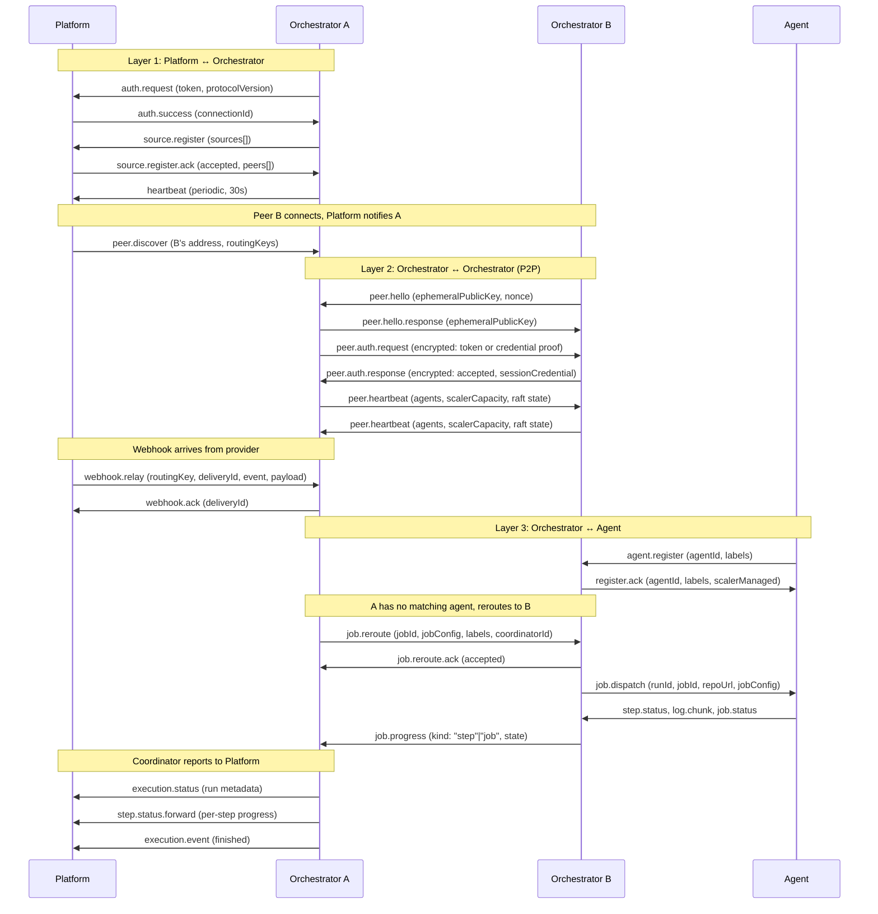

## Message flow overview

The following diagram shows the typical happy-path message flow across both WebSocket layers, from connection setup through webhook relay to job completion.

## Common messages

These messages are shared across both WebSocket layers.

> Authoritative source: `packages/engine/src/protocol/messages/common.ts`

### heartbeat

Sent periodically to keep the WebSocket connection alive. Both orchestrators (to Platform) and agents (to orchestrators) send heartbeats on a 30-second interval.

| Field     | Type          | Required | Description                   |
| --------- | ------------- | -------- | ----------------------------- |
| type      | `"heartbeat"` | Yes      | Message discriminator         |
| timestamp | number        | Yes      | Unix timestamp (milliseconds) |

> Authoritative source: `packages/engine/src/protocol/messages/common.ts` -- `heartbeatSchema`

### ack

Positive acknowledgment of a received message. Used for generic message-level acknowledgments.

| Field     | Type    | Required | Description                          |
| --------- | ------- | -------- | ------------------------------------ |
| type      | `"ack"` | Yes      | Message discriminator                |
| messageId | string  | Yes      | ID of the message being acknowledged |

> Authoritative source: `packages/engine/src/protocol/messages/common.ts` -- `ackSchema`

### nack

Negative acknowledgment -- the message was received but could not be processed.

| Field     | Type     | Required | Description                      |
| --------- | -------- | -------- | -------------------------------- |
| type      | `"nack"` | Yes      | Message discriminator            |
| messageId | string   | Yes      | ID of the message being rejected |
| reason    | string   | Yes      | Human-readable rejection reason  |

> Authoritative source: `packages/engine/src/protocol/messages/common.ts` -- `nackSchema`

### error

Protocol-level error notification. Sent when something goes wrong at the connection level.

| Field   | Type      | Required | Description                  |
| ------- | --------- | -------- | ---------------------------- |
| type    | `"error"` | Yes      | Message discriminator        |
| code    | string    | Yes      | Error code identifier        |
| message | string    | Yes      | Human-readable error message |

> Authoritative source: `packages/engine/src/protocol/messages/common.ts` -- `errorSchema`

## Authentication messages

Used during WebSocket connection establishment. The connecting party sends `auth.request` and the server responds with either `auth.success` or `auth.failure`.

> Authoritative source: `packages/engine/src/protocol/messages/auth.ts`

### auth.request

Sent by the connecting party (orchestrator to Platform, or agent to orchestrator) to authenticate.

| Field           | Type             | Required | Description                                                                                |
| --------------- | ---------------- | -------- | ------------------------------------------------------------------------------------------ |
| type            | `"auth.request"` | Yes      | Message discriminator                                                                      |
| token           | string           | Yes      | API key or authentication token                                                            |
| protocolVersion | number (int > 0) | Yes      | Protocol version (currently `1`)                                                           |
| capabilities    | OrchCapabilities | No       | Orchestrator capabilities (optional for backward compat with pre-capability orchestrators) |

**OrchCapabilities fields:**

| Field           | Type                          | Required | Description                                                                                                                                                                                                                                                                   |
| --------------- | ----------------------------- | -------- | ----------------------------------------------------------------------------------------------------------------------------------------------------------------------------------------------------------------------------------------------------------------------------- |
| orchRole        | `"coordinator"` \| `"worker"` | No       | Orchestrator's role in the cluster (coordinator manages DB/vault, worker is stateless)                                                                                                                                                                                        |
| dashboardWrites | Record\<string, boolean\>     | No       | Sparse per-operation dashboard-write policy map. Each present key flips one `DashboardWriteOperation` to `false`; missing keys default to `true` (permissive). Sent on auth so the upstream cache populates immediately; rebroadcast via `orch.capabilities.update` on change |

The schema uses `.passthrough()` so newer orchestrators can send additional flags without breaking older upstream versions. Unknown flags are preserved.

> Authoritative source: `packages/engine/src/protocol/messages/auth.ts` -- `authRequestSchema`

### auth.success

Sent by the server after successful authentication.

| Field          | Type             | Required | Description                                                                                                                                                                                                                                                              |
| -------------- | ---------------- | -------- | ------------------------------------------------------------------------------------------------------------------------------------------------------------------------------------------------------------------------------------------------------------------------ |
| type           | `"auth.success"` | Yes      | Message discriminator                                                                                                                                                                                                                                                    |
| connectionId   | string           | Yes      | Unique connection ID assigned by server                                                                                                                                                                                                                                  |
| orgPublicAlias | string           | No       | Public alias (`oal_<12-char>`) of the authenticated orchestrator's owning org. Used by the orchestrator's check-run emitter to build a `details_url` that points at the dashboard's resolver route, so the canonical `org_<12-char>` id never appears in public surfaces |

> Authoritative source: `packages/engine/src/protocol/messages/auth.ts` -- `authSuccessSchema`

### auth.failure

Sent by the server when authentication fails. The WebSocket connection is closed immediately after this message.

| Field  | Type             | Required | Description                   |
| ------ | ---------------- | -------- | ----------------------------- |
| type   | `"auth.failure"` | Yes      | Message discriminator         |
| reason | string           | Yes      | Human-readable failure reason |

> Authoritative source: `packages/engine/src/protocol/messages/auth.ts` -- `authFailureSchema`
