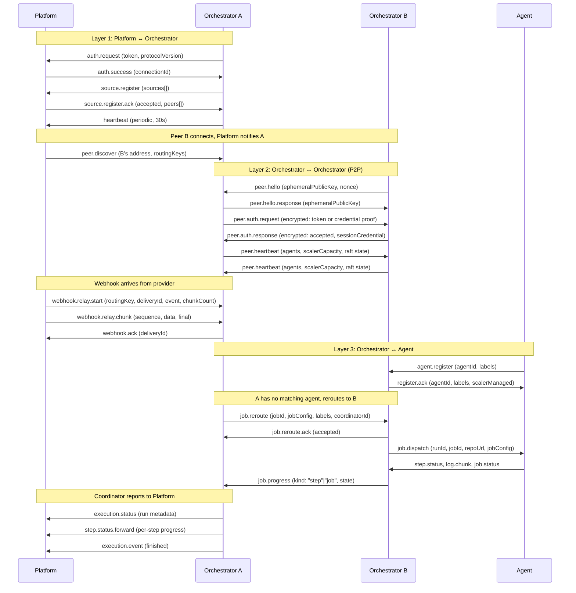

## Message flow overview

The following diagram shows the typical happy-path message flow across both WebSocket layers, from connection setup through webhook relay to job completion.

```mermaid
sequenceDiagram
    participant S as Platform
    participant O1 as Orchestrator A
    participant O2 as Orchestrator B
    participant A as Agent

    Note over S,O1: Layer 1: Platform ↔ Orchestrator

    O1->>S: auth.request (token, protocolVersion)
    S->>O1: auth.success (connectionId)
    O1->>S: source.register (sources[])
    S->>O1: source.register.ack (accepted, peers[])
    O1->>S: heartbeat (periodic, 30s)

    Note over S,O2: Peer B connects, Platform notifies A

    S->>O1: peer.discover (B's address, routingKeys)

    Note over O1,O2: Layer 2: Orchestrator ↔ Orchestrator (P2P)

    O2->>O1: peer.hello (ephemeralPublicKey, nonce)
    O1->>O2: peer.hello.response (ephemeralPublicKey)
    O1->>O2: peer.auth.request (encrypted: token or credential proof)
    O2->>O1: peer.auth.response (encrypted: accepted, sessionCredential)
    O1->>O2: peer.heartbeat (agents, scalerCapacity, raft state)
    O2->>O1: peer.heartbeat (agents, scalerCapacity, raft state)

    Note over S,O1: Webhook arrives from provider

    S->>O1: webhook.relay.start (routingKey, deliveryId, event, chunkCount)
    S->>O1: webhook.relay.chunk (sequence, data, final)
    O1->>S: webhook.ack (deliveryId)

    Note over O1,A: Layer 3: Orchestrator ↔ Agent

    A->>O2: agent.register (agentId, labels)
    O2->>A: register.ack (agentId, labels, scalerManaged)

    Note over O1,O2: A has no matching agent, reroutes to B

    O1->>O2: job.reroute (jobId, jobConfig, labels, coordinatorId)
    O2->>O1: job.reroute.ack (accepted)
    O2->>A: job.dispatch (runId, jobId, repoUrl, jobConfig)
    A->>O2: step.status, log.chunk, job.status
    O2->>O1: job.progress (kind: "step"|"job", state)

    Note over S,O1: Coordinator reports to Platform

    O1->>S: execution.status (run metadata)
    O1->>S: step.status.forward (per-step progress)
    O1->>S: execution.event (finished)
```

## Common messages

These messages are shared across both WebSocket layers.

> Authoritative source: `packages/engine/src/protocol/messages/common.ts`

### heartbeat

Sent periodically to keep the WebSocket connection alive. Both orchestrators (to Platform) and agents (to orchestrators) send heartbeats on a 30-second interval.

| Field     | Type          | Required | Description                   |
| --------- | ------------- | -------- | ----------------------------- |
| type      | `"heartbeat"` | Yes      | Message discriminator         |
| timestamp | number        | Yes      | Unix timestamp (milliseconds) |

> Authoritative source: `packages/engine/src/protocol/messages/common.ts` -- `heartbeatSchema`

### ack

Positive acknowledgment of a received message. Used for generic message-level acknowledgments.

| Field     | Type    | Required | Description                          |
| --------- | ------- | -------- | ------------------------------------ |
| type      | `"ack"` | Yes      | Message discriminator                |
| messageId | string  | Yes      | ID of the message being acknowledged |

> Authoritative source: `packages/engine/src/protocol/messages/common.ts` -- `ackSchema`

### nack

Negative acknowledgment -- the message was received but could not be processed. Also the **version-skew diagnosability** signal: when a peer receives a message type it does not understand (the other side is running a newer build), it replies with a NACK naming the unsupported type instead of silently dropping the frame. Without this, an unknown type surfaces only as a downstream proxy timeout; the NACK turns it into an explicit, logged, upgrade-actionable error. `nack` is a member of both the Platform-to-orchestrator and orchestrator-to-Platform unions -- either side can NACK the other.

| Field        | Type     | Required | Description                                                         |
| ------------ | -------- | -------- | ------------------------------------------------------------------- |
| type         | `"nack"` | Yes      | Message discriminator                                               |
| messageId    | string   | No       | ID of the offending frame, echoed when it carried one (correlation) |
| receivedType | string   | No       | The unsupported/unrecognized message type that triggered the NACK   |
| reason       | string   | Yes      | Human-readable rejection reason, including an upgrade hint          |

**Behavior on an unknown frame:** the receiver first runs its normal recognition schemas; only a frame that fails them all AND carries a `type` this build does not recognize is NACKed. The connection stays open -- a single unknown frame from an ahead-running peer must not tear down the whole link. The receiver distinguishes version skew from malformation using a recognized-type set derived from the schema discriminators: a frame whose `type` IS recognized but still failed validation (e.g. an oversized field past its length bound) is malformed, not skewed, so it gets no NACK -- it is handled like any other invalid frame (the Platform closes the connection; the orchestrator drops the frame with a warning rather than tearing down its own uplink). Two classes are deliberately exempt and stay drop-and-warn: a `nack` itself (loop guard -- a NACK is never NACKed) and pure streaming frames (`log.chunk` / `orch-log.chunk`, which cannot be correlated). A genuinely malformed frame with no `type` field is not NACKed either; it falls through to the connection-level close.

> Authoritative source: `packages/engine/src/protocol/messages/common.ts` -- `nackSchema`, `buildUnsupportedMessageNack`

### error

Protocol-level error notification. Sent when something goes wrong at the connection level.

| Field   | Type      | Required | Description                  |
| ------- | --------- | -------- | ---------------------------- |
| type    | `"error"` | Yes      | Message discriminator        |
| code    | string    | Yes      | Error code identifier        |
| message | string    | Yes      | Human-readable error message |

> Authoritative source: `packages/engine/src/protocol/messages/common.ts` -- `errorSchema`

## Authentication messages

Used during WebSocket connection establishment. The connecting party sends `auth.request` and the server responds with either `auth.success` or `auth.failure`.

> Authoritative source: `packages/engine/src/protocol/messages/auth.ts`

### auth.request

Sent by the connecting party (orchestrator to Platform, or agent to orchestrator) to authenticate.

| Field           | Type             | Required | Description                                                                                |
| --------------- | ---------------- | -------- | ------------------------------------------------------------------------------------------ |
| type            | `"auth.request"` | Yes      | Message discriminator                                                                      |
| token           | string           | Yes      | API key or authentication token                                                            |
| protocolVersion | number (int > 0) | Yes      | Protocol version (currently `1`)                                                           |
| capabilities    | OrchCapabilities | No       | Orchestrator capabilities (optional for backward compat with pre-capability orchestrators) |

**OrchCapabilities fields:**

| Field                      | Type                                                                         | Required | Description                                                                                                                                                                                                                                                                                                                               |
| -------------------------- | ---------------------------------------------------------------------------- | -------- | ----------------------------------------------------------------------------------------------------------------------------------------------------------------------------------------------------------------------------------------------------------------------------------------------------------------------------------------- |
| orchRole                   | `"coordinator"` \| `"worker"`                                                | No       | Orchestrator's role in the cluster (coordinator manages DB/vault, worker is stateless)                                                                                                                                                                                                                                                    |
| dashboardWrites            | Record\<string, boolean \| `"permissive"` \| `"encrypted"` \| `"disabled"`\> | No       | Sparse per-operation dashboard-write policy map. Each present key sets one `DashboardWriteOperation`'s posture; missing keys default to `permissive`. The boolean form is the equivalent shorthand (`false` = `disabled`). Sent on auth so the upstream cache populates immediately; rebroadcast via `orch.capabilities.update` on change |
| supportedDashboardRequests | string[]                                                                     | No       | Every `dashboard.*` request type this orchestrator build understands, so the upstream can detect a version mismatch explicitly. Absent means "unknown", never "supports nothing"                                                                                                                                                          |
| dashboardEncryptionKey     | OKP/X25519 JWK                                                               | No       | The orchestrator's active dashboard-encryption public key (`use: "enc"`), used by the browser to seal a secret / variable value under the `encrypted` posture. Absent when the orchestrator has no key provisioned                                                                                                                        |
| dashboardVerifiedIssuer    | string \| null                                                               | No       | Origin the browser should fetch that encryption key from directly, bypassing the control plane. Null / absent means the control-plane proxy is used instead                                                                                                                                                                               |

The schema uses `.passthrough()` so newer orchestrators can send additional flags without breaking older upstream versions. Unknown flags are preserved.

> Authoritative source: `packages/engine/src/protocol/messages/auth.ts` -- `authRequestSchema`

### auth.success

Sent by the server after successful authentication.

| Field            | Type             | Required | Description                                                                                                                                                                                                                                                                                                                                               |
| ---------------- | ---------------- | -------- | --------------------------------------------------------------------------------------------------------------------------------------------------------------------------------------------------------------------------------------------------------------------------------------------------------------------------------------------------------- |
| type             | `"auth.success"` | Yes      | Message discriminator                                                                                                                                                                                                                                                                                                                                     |
| connectionId     | string           | Yes      | Unique connection ID assigned by server                                                                                                                                                                                                                                                                                                                   |
| orgPublicAlias   | string           | No       | Public alias (`oal_<12-char>`) of the authenticated orchestrator's owning org. Used by the orchestrator's check-run emitter to build a `details_url` that points at the dashboard's resolver route, so the canonical `org_<12-char>` id never appears in public surfaces                                                                                  |
| orgId            | string           | No       | Canonical org id (`org_<...>`) of the authenticated orchestrator's owning org. The orchestrator auto-provisions a remote-run anchor (`remote:<orgId>`) from it so a relayed `kici run remote` resolves the real tenant. When absent, that provisioning is skipped                                                                                         |
| provenanceIssuer | string \| null   | No       | Provenance trust root (the OIDC issuer) the server mints build-provenance tokens under. The orchestrator derives the JWKS URI (`<issuer>/.well-known/jwks.json`) from it to verify provenance bundles at ingest. `null` or absent means provenance is not configured, and each attestation's verdict is recorded as `unverifiable` rather than `verified` |

Every field after `connectionId` is optional so an orchestrator can connect to a server that does not supply it -- each one degrades to the behavior described in its own row rather than failing the handshake.

> Authoritative source: `packages/engine/src/protocol/messages/auth.ts` -- `authSuccessSchema`

### auth.failure

Sent by the server when authentication fails. The WebSocket connection is closed immediately after this message -- with code `4010` (`WS_CLOSE_AGENT_AUTH_FAILED`) on the agent channel and `4001` (`WS_CLOSE_UNAUTHORIZED`) on the dashboard channel. See the [close-code table](./dashboard.md#websocket-close-codes) for the full inventory.

| Field  | Type             | Required | Description                   |
| ------ | ---------------- | -------- | ----------------------------- |
| type   | `"auth.failure"` | Yes      | Message discriminator         |
| reason | string           | Yes      | Human-readable failure reason |

> Authoritative source: `packages/engine/src/protocol/messages/auth.ts` -- `authFailureSchema`
