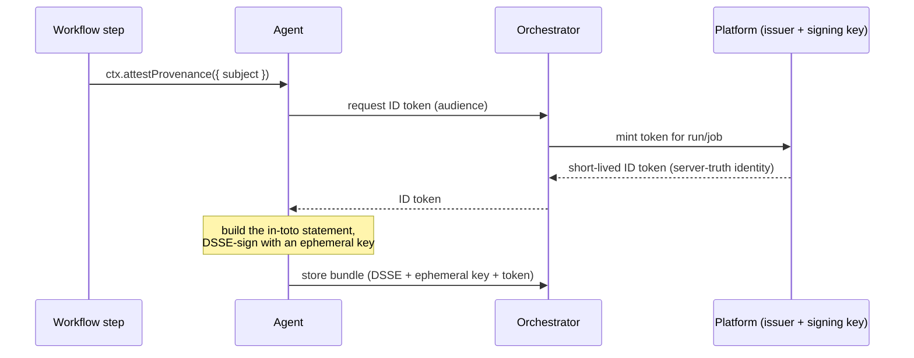

KiCI build provenance produces a signed, offline-verifiable statement of what
produced an artifact. This page covers how that signature is constructed across
the three tiers, what roots the trust, and how a verifier re-establishes the
whole chain. The workflow-author view is in the
[build provenance guide](../../user/provenance.md).

## Signing flow

When a step calls `ctx.attestProvenance`, the agent obtains a platform-issued
identity token, builds and signs the statement locally, and persists the
resulting bundle:

The identity claims — `repository`, `ref`, `sha`, run and job identifiers — are
**derived by the platform from its own record of the run and job**, not from
anything the agent or step asserts. The orchestrator only relays the request,
scoped to a job the requesting agent actually owns; it never lets a step name its
own repository or ref. This is what makes the identity claims trustworthy: the
build cannot lie about where it came from.

## Trust root

Each environment has one **ECDSA P-256 (ES256) signing key**, held in a hardware
security module. The private half is generated inside the module and never
leaves it — signing is a remote call, so a credential compromise grants signing
only while the credential is valid and can never exfiltrate the key.

The key's public half is published as a JSON Web Key Set (JWKS) at the platform's
well-known OIDC discovery endpoint. **Verifiers trust the published key set, not
the signing provider.** Swapping the underlying signing technology is therefore a
transparent key rotation — the only durable external contract is the JWKS.

## Bundle construction

The agent assembles a self-contained bundle so verification needs nothing but the
trusted key set:

1. Build an **in-toto SLSA v1.0 statement** — the subject (artifact name +
   digest) plus a provenance predicate populated from the identity token's
   server-truth claims.
2. Generate an **ephemeral ES256 key** in-process and **DSSE-sign** the statement
   with it.
3. Package the DSSE envelope, the ephemeral public key, and the identity token
   into one bundle.

The identity token stands in for a signing certificate: it binds the ephemeral
key's signature to the build identity, the same role a short-lived certificate
plays in certificate-based signing systems. The bundle is then persisted so the
dashboard can list it and the verification CLI can retrieve it.

## Verification chain

A verifier re-establishes trust from the published key set inward:

1. **JWKS → identity token.** Verify the identity token against the trusted JWKS,
   with its issuer **pinned to the configured trust root** (never read from the
   token itself), and check the audience.
2. **Token → ephemeral key.** The bundle's ephemeral public key is the one the
   DSSE signature must verify against; its key id must match the key's own
   thumbprint.
3. **Ephemeral key → DSSE signature.** Verify the DSSE signature over the
   statement with that key.
4. **Build-context cross-check.** The statement's build context must match the
   identity token's claims. A mismatch is a **hard failure** — this is the check
   that makes the model sound, because the build identity is server-truth while
   the statement is assembled on the agent.
5. **Subject digest (optional).** When a verifier supplies the artifact, its
   SHA-256 digest is matched against the subject. This is the only check that
   binds the attestation to specific bytes; the build identity is independent of
   it.

The build _identity_ is server-truth throughout; the artifact _digest_ is the
only build-supplied input.

## How it works today

- **Revocation is all-or-nothing.** A signing key's public half stays in the
  JWKS after it is rotated out, so historical attestations remain verifiable.
  Revoking a _compromised_ key removes it from the JWKS and distrusts every
  attestation it ever signed — there is no per-attestation trusted timestamp to
  scope revocation to "before time T". Time-scoped revocation requires a
  transparency log and is a future capability.
- **Trust roots are pinned over HTTPS.** Verifiers fetch the published key set
  from the configured issuer and pin the token's issuer to it, rather than
  following the issuer named in the token.
- **Self-hosted platforms are their own trust root.** A self-hosted platform
  publishes its own JWKS and is its own issuer; verifiers point `--trust-root` at
  it.
- **The bundle format is forward-compatible.** Verification dispatches on the
  bundle's media type, so additional bundle formats can be added without
  changing the verifier's existing path.
