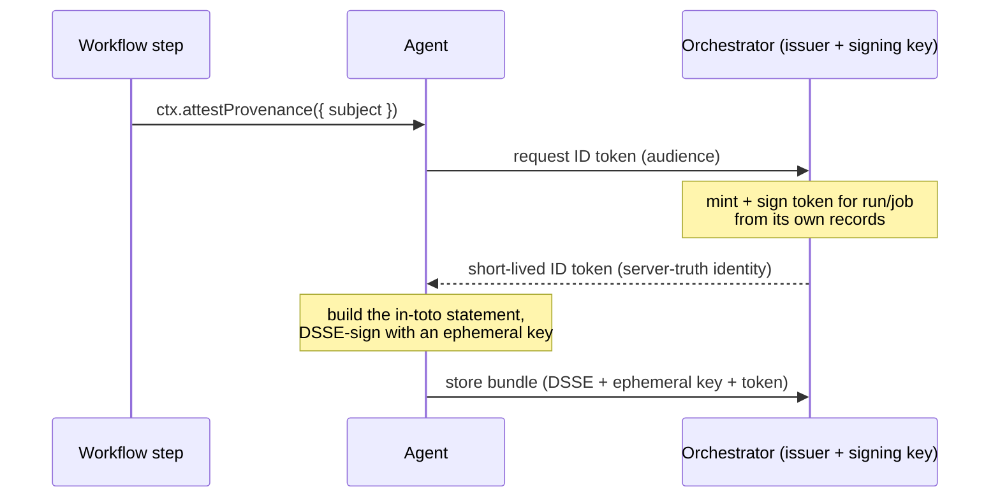

KiCI build provenance produces a signed, offline-verifiable statement of what
produced an artifact. This page covers how that signature is constructed across
the three tiers, what roots the trust, and how a verifier re-establishes the
whole chain. The workflow-author view is in the
[build provenance guide](../../user/provenance.md).

## Signing flow

When a step calls `ctx.attestProvenance`, the agent obtains an
orchestrator-issued identity token, builds and signs the statement locally, and
persists the resulting bundle. The orchestrator is the root of trust: it mints and
signs the token itself, with no hosted-platform dependency in the build hot path:

```mermaid
sequenceDiagram
    participant Step as Workflow step
    participant Agent
    participant Orchestrator as Orchestrator (issuer + signing key)
    Step->>Agent: ctx.attestProvenance({ subject })
    Agent->>Orchestrator: request ID token (audience)
    Note over Orchestrator: mint + sign token for run/job<br/>from its own records
    Orchestrator-->>Agent: short-lived ID token (server-truth identity)
    Note over Agent: build the in-toto statement,<br/>DSSE-sign with an ephemeral key
    Agent->>Orchestrator: store bundle (DSSE + ephemeral key + token)
```

The identity claims — `repository`, `ref`, `sha`, run and job identifiers — are
**derived by the orchestrator from its own record of the run and job**, not from
anything the agent or step asserts. The orchestrator resolves the request against
a job the requesting agent actually owns; it never lets a step name its own
repository or ref. This is what makes the identity claims trustworthy: the build
cannot lie about where it came from.

## Trust root

The orchestrator owns a long-lived **ECDSA P-256 (ES256) signing key**. Custody is
pluggable: by default the private key is encrypted at rest in the orchestrator's
database, wrapped with the orchestrator's master key (the master key lives in the
environment or a KMS, never in the database, so a database backup alone cannot
sign); it can also be held in AWS KMS or any external KMS/HSM via a signing
command, where the private key never exists inside KiCI at all. The private key is
non-exportable by design.

The key's public half is published as a JSON Web Key Set (JWKS) at the
orchestrator's well-known OIDC discovery endpoint. **Verifiers trust the published
key set, not the signing provider.** Swapping the underlying signing technology is
therefore a transparent key rotation — the only durable external contract is the
JWKS. For provisioning, custody, and rotation, see
[provenance signing keys](../../operator/orchestrator/signing-keys.md).

## Bundle construction

The agent assembles a self-contained bundle so verification needs nothing but the
trusted key set:

1. Build an **in-toto SLSA v1.0 statement** — the subject (artifact name +
   digest) plus a provenance predicate populated from the identity token's
   server-truth claims.
2. Generate an **ephemeral ES256 key** in-process and **DSSE-sign** the statement
   with it.
3. Package the DSSE envelope, the ephemeral public key, and the identity token
   into one bundle.

The identity token stands in for a signing certificate: it binds the ephemeral
key's signature to the build identity, the same role a short-lived certificate
plays in certificate-based signing systems. The bundle is then persisted so the
dashboard can list it and the verification CLI can retrieve it.

## Verification chain

A verifier re-establishes trust from the published key set inward:

1. **JWKS → identity token.** Verify the identity token against the trusted JWKS,
   with its issuer **pinned to the configured trust root** (never read from the
   token itself), and check the audience.
2. **Token → ephemeral key.** The bundle's ephemeral public key is the one the
   DSSE signature must verify against; its key id must match the key's own
   thumbprint.
3. **Ephemeral key → DSSE signature.** Verify the DSSE signature over the
   statement with that key.
4. **Build-context cross-check.** The statement's build context must match the
   identity token's claims. A mismatch is a **hard failure** — this is the check
   that makes the model sound, because the build identity is server-truth while
   the statement is assembled on the agent.
5. **Subject digest (optional).** When a verifier supplies the artifact, its
   SHA-256 digest is matched against the subject. This is the only check that
   binds the attestation to specific bytes; the build identity is independent of
   it.

The build _identity_ is server-truth throughout; the artifact _digest_ is the
only build-supplied input.

## How it works today

- **Revocation is all-or-nothing.** A signing key's public half stays in the
  JWKS after it is rotated out, so historical attestations remain verifiable.
  Revoking a _compromised_ key removes it from the JWKS and distrusts every
  attestation it ever signed — there is no per-attestation trusted timestamp to
  scope revocation to "before time T". Time-scoped revocation requires a
  transparency log and is a future capability.
- **The trust root is pinned out-of-band.** Verifiers fetch the published key set
  from the orchestrator's provenance issuer and pin the token's issuer to it,
  rather than following the issuer named in the token. `kici verify-attestation`
  defaults its trust root to the configured orchestrator; it can also verify
  offline against an exported `{ issuer, jwks }` file (air-gap) or against the
  orchestrator's native `POST /v1/verify-attestation` endpoint. Bundles signed by
  the hosted platform before the orchestrator owned signing keep verifying against
  the platform's still-published JWKS.
- **The bundle format is forward-compatible.** Verification dispatches on the
  bundle's media type, so additional bundle formats can be added without
  changing the verifier's existing path.

## Verify-at-ingest and stored verdicts

Beyond on-demand verification (CLI or in-browser), the orchestrator verifies
each provenance bundle **at ingest** — when it records the attestation — and
stores the verdict alongside the row. This is what makes the org-wide
attestations browser trustworthy at any scale: the list shows a real badge per
row with no per-row bundle fetch or re-verification.

The stored verdict is one of:

- **verified** — the bundle's signature, build identity, and build context all
  checked out against the provenance trust root.
- **failed** — verification ran and the bundle did not pass (bad signature,
  mismatched identity, or unsupported bundle mode). A provenance-integrity
  signal; the first failure code is stored.
- **unverifiable** — no verdict could be computed: the trust root is not
  configured, or its key set / the bundle could not be read. This is **not** a
  forgery signal — it means "we could not check", distinct from "we checked and
  it failed".
- **pending** — the verdict has not been computed yet (a row recorded before
  verification, awaiting backfill).

The verdict is a point-in-time record over an immutable bundle. The
attestation-detail page offers a live re-verification against the current
signing keys, and operators backfill or refresh stored verdicts with
`kici-admin attestations reverify`.

**Trust root at ingest.** When orchestrator-owned signing is configured, the
orchestrator verifies at ingest against its **own** key set — read directly from
its signing-keys store, so fresh rotations and revocations are reflected
immediately. Bundles signed by the hosted platform before the orchestrator owned
signing are verified against the platform's provenance issuer instead. When no
provenance trust root is configured, every verdict is recorded as `unverifiable`
rather than silently `verified`. The orchestrator
never mints tokens or holds signing material — it only consumes the public
issuer + key set to check bundles.

## Deferred attestations (attest-later)

Minting the identity token is the one part of attestation that needs the hosted
Platform. When the Platform is briefly unreachable during a build's mint, the
attestation is **deferred** rather than lost, and the job stays green.

The lifecycle:

1. **Freeze at build time.** The agent builds the statement from its own job
   context and DSSE-signs it with its ephemeral key immediately — no Platform
   needed. The attested facts are sealed live; only the identity token is
   deferred.
2. **Capture to a durable outbox.** On a transient mint failure the agent
   reports the frozen envelope, ephemeral public key, and a `statement_hash` to
   the orchestrator, which records a row in the cluster-shared
   `pending_attestations` outbox. A permanent rejection (a genuinely bad request)
   still fails the step — only transient failures defer.
3. **Fulfil later.** A Raft-leader-only retrier mints each pending attestation
   exactly once — on a periodic sweep and immediately when the orchestrator's
   Platform connection re-authenticates. It requests the identity token bound to
   the frozen `statement_hash`, attaches it to the already-frozen envelope,
   uploads the bundle, records the attestation with a verify-at-ingest verdict,
   and drains the outbox row. Operators can trigger a drain on demand with
   `kici-admin attestations retry`.
4. **Run-sync backfill.** A run ingested while the Platform was fully down has no
   Platform run/job records for the mint to read, so the retrier first replays
   the run and job status the Platform missed (the same org-asserted data the
   live path sends), then mints.

### Truth contract

Deferral preserves the attestation's truth:

- **No tamper window.** The statement is frozen and DSSE-signed at build time;
  the digest _is_ the artifact.
- **Statement-hash binding.** The deferred identity token commits to the frozen
  statement by hash, so the Platform identity cannot be re-bound to a different
  artifact at retry time. A verifier recomputes the hash and hard-fails on a
  mismatch.
- **Temporal honesty.** The predicate keeps the true build timestamps; the token
  is minted later against a knowingly-completed job (the Platform relaxes its
  live-job check only for an explicitly-flagged deferred mint). The bundle
  carries a mint-timing marker — `deferred`, or `offline-backfill` for a
  fully-offline-ingested run — so the gap is disclosed, never hidden.
- **Anchor preserved.** The organization id remains the only un-forgeable anchor,
  exactly as in the live path; `repo` / `ref` / `sha` are organization-asserted
  in both paths, so backfill concedes no independence the live path did not.

`kici verify-attestation` surfaces the `deferred` / `offline-backfill` marker on
a PASS; the orchestrator exposes `kici_orch_pending_attestations_current` and
`kici_orch_pending_attestation_oldest_age_seconds` gauges for the outbox depth.
