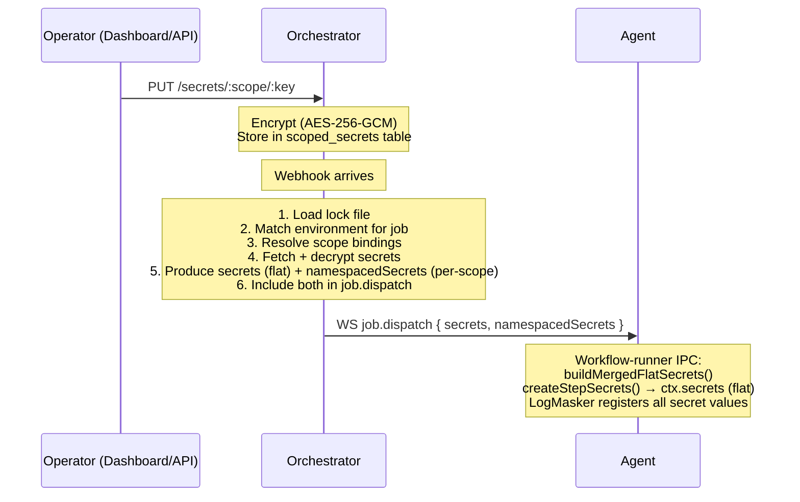

KiCI's secrets management provides encrypted storage, context-scoped access, and multi-backend support. This document describes the internal architecture, encryption model, and data flow from secret creation to workflow step execution.

## Data flow

The secrets lifecycle spans all three tiers:



**Key design principle:** The Platform tier never sees secrets. Secrets flow only from the orchestrator to the agent via the authenticated WebSocket channel.

## Encryption model

### Algorithm

- **Cipher:** AES-256-GCM (authenticated encryption with associated data)
- **Key size:** 256 bits (32 bytes)
- **IV:** 12 random bytes per encryption operation
- **Auth tag:** 16 bytes (128-bit GCM tag)

### Wire format

Each encrypted value is stored as a single base64-encoded string:

```
base64( IV [12 bytes] || AuthTag [16 bytes] || Ciphertext [variable] )
```

This format allows single-field storage in PostgreSQL while keeping all cryptographic material together.

### Additional authenticated data (AAD)

Every encryption operation binds the ciphertext to its storage location using AAD:

```
AAD = "orgId:scope:key"
```

This prevents cross-scope secret swaps -- a ciphertext encrypted for scope A with key "TOKEN" cannot be decrypted under scope B or key "PASSWORD", even with the same master key.

### Key derivation

The master key (`KICI_SECRET_KEY`) supports two input formats:

1. **64-character hex string** -- decoded to 32 bytes directly
2. **Base64-encoded string** -- decoded to 32 bytes

The `deriveKey()` function normalizes either format to a 32-byte Buffer.

### Key versioning

Each encrypted value stores a `keyVersion` integer. The `rotateKey()` method re-encrypts all values at an incremented version. When an old key is configured, `rotateKey()` decrypts with the old key and re-encrypts with the new (current) key. Without an old key, it performs same-key re-encryption.

### Key rotation design

The secrets subsystem supports zero-downtime master key rotation through a dual-key decrypt fallback pattern -- the same approach used for per-run ephemeral key encryption in `ephemeral-keys.ts`.

**Dual-key decrypt fallback:**

All read paths (`getSecrets`, `decryptValue`) use a `decryptWithFallback()` method that:

1. Tries decrypting with the current master key
2. If decryption fails and an old master key is configured, retries with the old key
3. If both fail, throws an error

This ensures zero-downtime during rolling restarts: instances with the new key can read secrets encrypted with the old key, while instances still running with the old key can read secrets they encrypted previously.

**`rotateKey()` behavior:**

- **With `oldMasterKey` set:** Decrypts each secret with the old key and re-encrypts with the current (new) key. This is true key rotation.
- **Without `oldMasterKey`:** Decrypts and re-encrypts with the same key at an incremented version. This is periodic re-encryption (same-key version bump).

**Configuration:**

The old key is loaded from `KICI_SECRET_KEY_OLD` (env var) or `KICI_SECRET_KEY_FILE_OLD` (file path). The `loadOldMasterKey()` function returns `undefined` when neither is set, making the old key entirely optional.

## Multi-backend architecture

### SecretStore interface

The `SecretStore` interface (in `@kici-dev/engine`) defines the contract for secret storage backends:

```typescript
interface SecretStore {
  getSecrets(orgId: string, scope: string): Promise<Record<string, string>>;
  setSecret(orgId: string, scope: string, key: string, value: string): Promise<void>;
  deleteSecret(orgId: string, scope: string, key: string): Promise<void>;
  listKeys(orgId: string, scope: string): Promise<string[]>;
  listScopes(orgId: string): Promise<string[]>;
  createScope?(orgId: string, scope: string): Promise<void>;
  renameScope?(orgId: string, oldScope: string, newScope: string): Promise<void>;
  deleteScope?(orgId: string, scope: string): Promise<void>;
  getAllSecrets(
    orgId: string,
  ): Promise<Array<{ scope: string; key: string; encryptedValue: string; keyVersion: number }>>;
}
```

### PG backend

The default backend stores secrets in the `scoped_secrets` PostgreSQL table. Each value is AES-256-GCM encrypted with the master key. Secrets are organized by org ID and scope (e.g., environment name, repo pattern).

Tables:

- `scoped_secrets` -- encrypted key-value pairs (org ID, scope, key name, encrypted data, backend type, key version)
- `admin_tokens` -- RBAC tokens (hash, role, label, routing key scope)
- `secret_audit_log` -- audit entries (action, context, user, outcome, timestamp)

### Vault backend

The Vault backend delegates secret storage to HashiCorp Vault's KV v2 engine. Each context maps to a Vault path:

```
{mountPath}/data/{basePath}/{contextId}
```

Vault-backed secrets use the `backend_type` field on `scoped_secrets` rows to route operations to the Vault backend.

### Backend routing

Secret operations are routed to the correct backend based on the `backend_type` field on each `scoped_secrets` row:

```
backend_type === 'pg'    --> PgSecretStore
backend_type === 'vault' --> VaultSecretStore
```

The orchestrator initializes available backends at startup and registers them in a `Map<string, SecretStore>`.

## Access control

Secret access control is handled by the environment protection pipeline, not by the secrets subsystem directly. Environments define branch restrictions, trigger type filters, and repository patterns. When a job targets an environment, the protection pipeline evaluates these rules before the job is dispatched. If the environment gates pass, the SecretResolver resolves secrets for that environment using scope bindings.

This separation means the secrets subsystem focuses on storage and encryption, while the environment system handles access policy.

## Secret resolution at dispatch time

The `SecretResolver` orchestrates the full resolution flow. It resolves secrets for a job by matching environment bindings against scoped secrets:

```typescript
resolveForJob(orgId: string, environmentName: string): Promise<Record<string, string>>
```

Resolution steps:

1. Look up the environment by name in the org
2. Get secret scope bindings for that environment
3. Load all scoped secrets for the org
4. Match and merge using longest-path-wins semantics (via the engine's `resolveSecretsForEnvironment`)
5. Return a flat `Record<string, string>` of decrypted secrets

## Test-run secret resolution

`kici run remote` dispatches a test run rather than a webhook-driven run, and the orchestrator resolves secrets for it through a dedicated test-scoped branch. The result combines two sources:

1. **CLI-uploaded local secrets.** The developer's local secret values (from `.kici/.secrets`, `.kici/.env.local`, `.kici/secrets.yaml`, and `--env` flags) are uploaded as an **encrypted** blob with the run. The orchestrator decrypts it only to inject the values into the agent for that run.
2. **Test-environment secrets.** The orchestrator resolves secrets from the `scoped_secrets` store for the job's own declared `environment` (flat; static strings and pure inline `environment` expressions evaluated against the fixture event — impure dynamic environments are not evaluated for test runs) and for each fixture `secrets: { ctx: envName }` mapping (namespaced under context `ctx`).

The two sources are merged so that **CLI-uploaded values win** on key collision, giving the developer a per-run override.

**`allowLocalExecution` resolution filter.** Test-environment resolution is gated by the environment's `allow_local_execution` flag (default `false`):

- An environment with the flag off is never resolvable for a test run — its secrets are not loaded.
- The gate applies to **all** remote test runs: a run whose matched workflow targets an environment with the flag off is rejected before dispatch.
- A fixture mapping that points a context at a missing environment, or at one whose flag is off, **rejects the run** (fail-closed).

This keeps production secrets unreachable from test runs: only environments an operator has explicitly opted into test access (`allow_local_execution = true`) can contribute secrets, and the developer's own uploaded values stay encrypted end to end.

## RBAC model

### Roles and permissions

The orchestrator secrets admin API uses a fixed three-role model (defined in `packages/orchestrator/src/secrets/rbac.ts`): `owner`, `admin`, and `auditor`.

| Permission             | Owner | Admin | Auditor |
| ---------------------- | ----- | ----- | ------- |
| context.create         | Y     | Y     | -       |
| context.read           | Y     | Y     | Y       |
| context.update         | Y     | Y     | -       |
| context.delete         | Y     | Y     | -       |
| secret.read            | Y     | Y     | -       |
| secret.write           | Y     | Y     | -       |
| secret.delete          | Y     | Y     | -       |
| secret.reveal          | Y     | Y     | -       |
| audit.read             | Y     | Y     | Y       |
| token.manage           | Y     | -     | -       |
| key.rotate             | Y     | -     | -       |
| run.read               | Y     | Y     | Y       |
| run.cancel             | Y     | Y     | -       |
| event_log.read         | Y     | Y     | Y       |
| event_log.read_payload | Y     | Y     | -       |
| access_log.read        | Y     | Y     | Y       |
| scheduled_job.trigger  | Y     | Y     | -       |

### Token authentication

Admin API tokens are stored as SHA-256 hashes in the `admin_tokens` table. Token validation:

1. Hash the incoming token with SHA-256
2. Look up the hash in the database
3. Check that the token is not revoked
4. Return the associated role and routing key scope

### Bootstrap token

On first startup with `KICI_SECRET_KEY`, the orchestrator generates a bootstrap token with `owner` role. This token is:

- Printed to the logs for operator retrieval
- Upserted on the `label='bootstrap'` column for idempotent restarts
- Overridable via `KICI_BOOTSTRAP_ADMIN_TOKEN` for automation

## Audit logging

All admin operations and dispatch-time access checks are logged to `secret_audit_log`:

| Field               | Description                                                     |
| ------------------- | --------------------------------------------------------------- |
| `action`            | Operation type (createContext, setSecret, resolveSecrets, etc.) |
| `context_name`      | Context involved                                                |
| `routing_key`       | Routing key scope                                               |
| `secret_keys`       | Array of key names involved (no values)                         |
| `outcome`           | `allowed` or `denied`                                           |
| `user_id`           | Token ID that performed the operation                           |
| `role`              | Role of the token                                               |
| `run_id` / `job_id` | Associated execution (for dispatch-time entries)                |
| `metadata`          | Additional context (JSONB)                                      |

## Security considerations

### Platform never sees secrets

Secrets flow from the orchestrator directly to the agent via the authenticated WebSocket channel. The Platform tier only routes webhooks and never handles secret material.

### Transit encryption

The WebSocket connection between orchestrator and agent should use TLS (WSS) in production to protect secrets in transit.

### No environment variable injection

Secrets are NOT automatically injected as environment variables. They are available via `ctx.secrets.get()` and `ctx.secrets.expose()` in step code. To pass a secret to a subprocess, the workflow author must explicitly use `expose()` to inject it into the environment or inline it:

```typescript
step('deploy', async ({ $, secrets }) => {
  await secrets.expose('DEPLOY_TOKEN');
  await $`deploy.sh`;
});
```

### Log masking

The agent's `LogMasker` replaces all known secret values in log output with `***`. This uses a single combined regex per line for performance. Secret values are registered with the masker before step execution begins.

### AAD prevents swaps

The additional authenticated data (AAD) binding prevents an attacker with database access from swapping encrypted values between scopes or keys. Each ciphertext is cryptographically bound to its `orgId:scope:key` location.

## StepContext secret construction

### StepSecrets interface

The SDK provides an async accessor interface for step secrets (`packages/sdk/src/secrets.ts`):

```typescript
interface StepSecrets {
  get(key: string): Promise<string>;
  expose(key: string): Promise<void>;
  has(key: string): boolean;
  getMeta(key: string): SecretMeta | undefined;
}
```

- **`get(key)`** -- retrieves a secret value by key. Throws `SecretNotFoundError` if the key does not exist, listing all available keys in the error message for fail-fast debugging.
- **`expose(key)`** -- injects a secret into the step's environment variables. Throws `SecretNotFoundError` if the key does not exist.
- **`has(key)`** -- synchronous existence check. Returns `boolean`, never throws. Use this for conditional patterns where a secret may or may not be present.
- **`getMeta(key)`** -- retrieves metadata about a resolved secret (backend name and scope). Returns `SecretMeta | undefined` -- `undefined` if the key does not exist. Use this to inspect which backend and scope provided a specific secret.

### Flat merge logic

The `buildMergedFlatSecrets()` function (in `packages/agent/src/execution/sandbox/secret-merge.ts`) merges secrets for `ctx.secrets`:

1. Start with orchestrator-level secrets as the base
2. Iterate over namespaced secrets in declaration order
3. For each namespace, merge all its keys into the flat map (overwriting any existing keys)

**Precedence:** orchestrator-level < namespaced keys. Among namespaces, later entries win for key collisions.

### Wire format

The WS `job.dispatch` message carries two fields:

- `secrets` -- flat `Record<string, string>` (orchestrator-level secrets)
- `namespacedSecrets` -- `Record<string, Record<string, string>>` keyed by scope name (optional)

The workflow-runner receives both fields and uses `buildMergedFlatSecrets()` to produce the final merged flat map, which backs the `StepSecrets` instance exposed as `ctx.secrets`.

### Fail-fast on missing keys

The `get()` and `expose()` methods throw `SecretNotFoundError` for missing keys, listing all available keys in the error message. This fail-fast pattern prevents typos like `ctx.secrets.get('DEPLO_TOKEN')` from silently returning `undefined` and causing cryptic failures downstream.

The `has()` method provides safe existence checking for conditional patterns where a secret may or may not be present:

```typescript
if (ctx.secrets.has('OPTIONAL_KEY')) {
  const val = await ctx.secrets.get('OPTIONAL_KEY');
}
```
