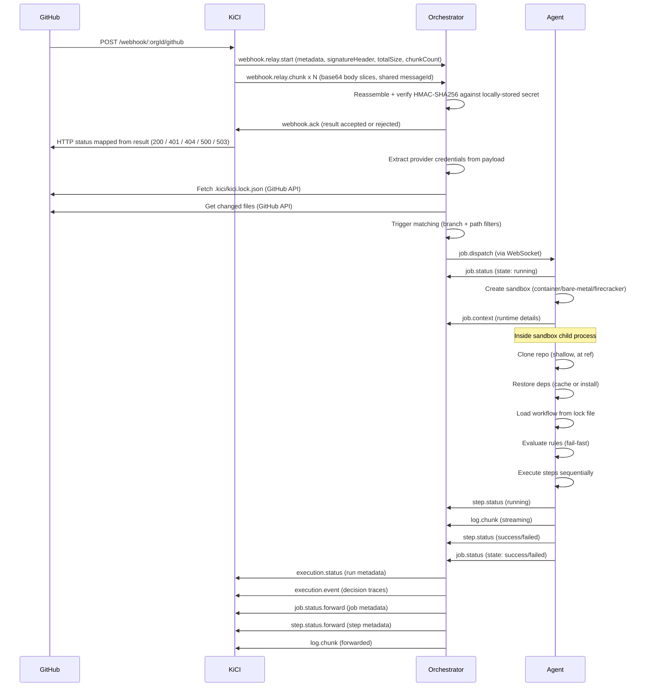

When a GitHub webhook fires (e.g., a push event), it travels through all three KiCI tiers before reaching execution. This page traces the complete journey from GitHub's HTTP POST through signature verification, WebSocket relay, trigger matching, and job execution.

## Happy path sequence diagram



## Step-by-step walkthrough

### Step 1: GitHub sends webhook

GitHub POSTs the webhook payload to the KiCI ingest endpoint:

```
POST https://kici.dev/webhook/<orgId>/github
```

GitHub includes these headers with every webhook delivery:

| Header                                   | Purpose                                       |
| ---------------------------------------- | --------------------------------------------- |
| `X-GitHub-Hook-Installation-Target-ID`   | GitHub App ID (identifies the KiCI app)       |
| `X-GitHub-Hook-Installation-Target-Type` | Must be `"integration"` for GitHub Apps       |
| `X-Hub-Signature-256`                    | HMAC-SHA256 signature of the payload          |
| `X-GitHub-Delivery`                      | Unique delivery ID for this webhook           |
| `X-GitHub-Event`                         | Event type (e.g., `"push"`, `"pull_request"`) |

### Step 2: KiCI routes the webhook

KiCI receives the webhook, validates provider headers, resolves the routing key, dedups against its delivery log, and chunk-relays the body bytes byte-identical to the orchestrator that owns the routing key over the existing WebSocket — load-balanced across the pool of connected orchestrators, retried against the next candidate on ACK timeout, and cross-routed to a remote KiCI instance if the orchestrator is connected elsewhere. KiCI never sees customer signing material; signature verification happens entirely on the orchestrator after reassembly.

### Failure modes

| Condition                                               | HTTP status            | Where decided                              |
| ------------------------------------------------------- | ---------------------- | ------------------------------------------ |
| Body > 25 MiB                                           | 413                    | HTTP body-limit, before any WS work        |
| Negative-cache hit on unknown `(orgId, routingKey)`     | 404                    | `unknown-source-cache.ts`                  |
| Orchestrator ACK `result: accepted`                     | 200                    | `statusForResult()`                        |
| Orchestrator ACK `result: rejected_signature`           | 401                    | `statusForResult()`                        |
| Orchestrator ACK `result: rejected_unknown_source`      | 404                    | `statusForResult()`; primes negative cache |
| Orchestrator ACK `result: rejected_misconfigured`       | 500                    | `statusForResult()`                        |
| No orch in pool, all candidates timed out, or no remote | 503 + `Retry-After: 5` | `routes/webhooks.ts`                       |

### Step 9: Orchestrator processes webhook

The orchestrator reassembles the body from the chunked stream, verifies the signature locally via `verifyInboundWebhook()` (`packages/orchestrator/src/webhook/verify-inbound.ts`), ACKs upstream with the verdict, and on `accepted` runs the body through the provider-agnostic processing pipeline:

1. **Dedup:** Check dual-layer dedup cache (in-memory + DB) by delivery ID
2. **Provider lookup:** Get the provider bundle from the ProviderRegistry using `getByRoutingKey()` (exact match first, falls back to provider type prefix for backward compatibility)
3. **Event normalization:** Use the provider's `WebhookNormalizer` to map the event/action to a `SimulatedEvent` (e.g., `push` -> `{ type: 'push', targetBranch: '...' }`)
4. **Repo and credential extraction:** Extract repository identifier and provider-specific credentials from the payload (e.g., GitHub installation ID)
5. **Command interception:** For `issue_comment` events, intercept `/kici approve` and `/kici reject` commands via `handleApprovalComment()` for security hold management (before normal trigger matching)
6. **Trust resolution (PR events):** For pull request events, resolve the contributor's trust tier to determine lock file source (head for trusted, base for untrusted)
7. **Lock file fetch:** Use the provider's `LockFileFetcher` (through LRU cache) to fetch `.kici/kici.lock.json` from the repository at the commit SHA. For untrusted PRs, fetches both base and head lock files in parallel
8. **Workflow modification detection:** For untrusted PR events, compare base and head lock files via `detectWorkflowModifications()` and apply security holds when non-trusted contributors modify workflow files
9. **Registration extraction (default-branch push):** On pushes to the default branch, extract registerable workflows and persist them for cluster-wide event matching
10. **Event router notification:** After the registrations are persisted, if event routing is active, emit a `registration.updated` event via `eventRouter.emit()`. Workflow event subscriptions are the persisted registrations themselves; the event router matches emitted events against them through the registration index
11. **Changed files:** Use the provider's `ChangedFilesFetcher` to get files changed in this push/PR (for path-based trigger filtering; skipped when no workflow uses path filters)
12. **Trigger matching:** Evaluate all workflows in the lock file against the event using `matchAllWorkflows()` from `@kici-dev/engine`
13. **Source and dep cache check:** For each matched workflow, check the source tarball cache by `contentHash` and dep cache by `lockfileHash` (see [Source tarball caching flow](#source-tarball-caching-flow) below)
14. **Job dispatch:** For each matched workflow, dispatch static jobs to agents via the agent dispatcher (with `sourceTarUrl`/`depsUrl` if cache hit)

> Source: `packages/orchestrator/src/pipeline/process-webhook.ts` -- `processWebhook()`

### Step 10: Orchestrator dispatches jobs

For each matched workflow, the orchestrator:

1. Generates a UUID `runId` per matched workflow (each workflow gets its own `runId` so execution tracking, check runs, and upstream event forwarding don't collide when multiple workflows match the same webhook)
2. Checks the source tarball cache for the workflow's `contentHash` and the dep cache for the lock file's `lockfileHash` (if configured)
3. Iterates over the workflow's jobs (static jobs only -- dynamic jobs are resolved at agent runtime)
4. Sends a `job.dispatch` message to a matching agent via WebSocket, including `sourceTarUrl`/`sourceTarHash` and `depsUrl`/`depsHash` if the respective caches hit
5. Tracks the job in the queue and marks the agent slot as occupied

If no agent with matching labels is connected, the job is queued and dispatched when a matching agent connects.

> Source: `packages/orchestrator/src/pipeline/process-webhook.ts`, `packages/orchestrator/src/agent/dispatcher.ts`

### Step 11: Agent executes job

The agent receives the `job.dispatch` message and runs the full job lifecycle. Customer code runs inside an `ExecutionSandbox` (container, bare-metal, or firecracker), never in the agent's V8 isolate:

1. **Report running:** Send `job.status: running` immediately
2. **Create sandbox:** Determine execution mode and create the appropriate sandbox backend
3. **Sandbox setup:** Prepare the execution environment (container: create + start; bare-metal: validate; firecracker: detect)
4. **Emit context:** Send `job.context` with runtime details (Node version, OS, arch, sandbox type)
5. **Sandbox execution (child process):**
   - Restore source: download cached `.kici/` source tarball (`sourceTarUrl`) and extract it into the work directory. Build jobs do a `git clone` + checkout; execution jobs do not.
   - Restore deps: download cached dependency tarball (`depsUrl`) with SHA-256 verification, or fall back to `npm ci` inline if the cache missed
   - Load workflow: register the shared `@kici-dev/shared/ts-loader-hook` and dynamic-`import()` the workflow `.ts` from the extracted source. Verify the computed `contentHash` against the lock file's value (drift guard) before any step runs.
   - Evaluate rules: run job-level rules sequentially with fail-fast (if any rule fails, job is skipped)
   - Execute steps: run each step sequentially with timeout and abort support
6. **Stream logs:** Send `log.chunk` messages to the orchestrator during execution (batched by `LogStreamer`)
7. **Report status:** Send `step.status` and `job.status` messages at each lifecycle boundary
8. **Cleanup:** Tear down sandbox and remove work directory

> Source: `packages/agent/src/execution/job-runner.ts`, `packages/agent/src/execution/sandbox/workflow-runner.ts`

## Delivery log

The orchestrator persists a per-delivery row keyed by `(org_id, delivery_id)` to its `event_log` table. The row carries the event metadata plus a pointer to the gzipped payload in object storage at `event-log/<orgId>/<deliveryId>.json.gz` (written via the orchestrator's `LogStorage` adapter, the same backend that holds run logs).

When the inbound payload exceeds `eventLog.maxPayloadBytes` (default 5 MB), the row is recorded with `payload_omitted=true` + reason `'size_exceeded'` and the upload is skipped. Storage upload failures degrade to `payload_omitted=true` + reason `'storage_failed'` -- the row is still written so the delivery is visible.

### Cleanup

The orchestrator keeps event-log rows in the warm `event_log` table for a 30-day warm TTL. Past that window the hourly `cold-store-archive` scheduled job packages each row's metadata into gzipped chunks in cold storage and deletes the warm row (`packages/orchestrator/src/cold-store/tables/event-log.ts`). The gzipped payload body the row points at is **not** deleted -- it stays in object storage indefinitely so the dashboard delivery-detail page resolves payload reads identically for warm and archived rows.

> Sources: `packages/orchestrator/src/webhook/event-log.ts` (writer), `packages/orchestrator/src/cold-store/tables/event-log.ts` (archival), `packages/orchestrator/src/dashboard/handler.ts` (`handleEventLogList/Detail`).

## Source tarball caching flow

The orchestrator includes a source tarball cache (and a separate dependency tarball cache) that stores the raw `.kici/` directory, keyed by the workflow's content hash. This cache sits in the pipeline between trigger matching and job dispatch, avoiding redundant cloning + installing.

```
webhook -> dedup -> normalize -> lock file -> trigger match -> CACHE CHECK -> dispatch
```

### Cache hit

When a workflow's `contentHash` is found in the cache:

1. The orchestrator retrieves the source tarball URL from the cache storage (`S3CacheStorage`)
2. The URL is a pre-signed S3 GET URL (15-minute expiry); the `touch-on-read` refreshes the entry's TTL
3. The `sourceTarUrl` and `sourceTarHash` (the workflow's `contentHash`, not the tarball-bytes hash) are included in the `job.dispatch` message. The dep cache provides `depsUrl`/`depsHash` the same way.
4. The execution agent downloads and extracts the tarball, registers the shared TypeScript loader hook, and dynamic-imports the workflow `.ts` directly — no `git clone`, no runtime bundler.

### Cache miss

When a workflow's `contentHash` is not in the cache:

1. The orchestrator increments the cache miss metric
2. The build coordinator is invoked with `ensureBuild(coalescingKey, triggerBuild)` where the coalescing key combines `contentHash` and `lockfileHash` (e.g., `abc123:def456`)
3. If another build for the same coalescing key is already in-flight, the request coalesces on the same Promise
4. A build agent job is dispatched with `buildOnly: true` in the job config (plus `buildSourceNeeded` / `buildDepsNeeded` flags)
5. The build agent clones the repo, runs `npm ci`, packs the `.kici/` source tarball (`source/{contentHash}.tar.gz`) and — if missing — the deps tarball (`deps/{platform}-{arch}/{lockfileHash}.tar.gz`), and uploads both via pre-signed PUT URLs
6. After the build completes, the orchestrator retrieves the source + deps URLs and dispatches execution jobs with them
7. If the build fails or times out, execution is skipped entirely for that workflow with a "Build failed" check status. Workflows containing dynamic job entries are allowed to proceed with their dynamic eval jobs (which compile from source inside the sandbox).

### Lock files without a content hash

Workflows without a `contentHash` field (schema version 1 lock files) bypass the cache entirely. Agents compile from source. Regenerate lock files with `pnpm kici compile` to enable caching. The current lock file schema version is 29; the orchestrator rejects any fetched lock whose `schemaVersion` does not exactly match the version it was compiled against, so a stale lock must be recompiled with `pnpm kici compile` and pushed again.

### Prometheus metrics

| Metric                                | Type      | Description                                              |
| ------------------------------------- | --------- | -------------------------------------------------------- |
| `kici_orch_source_cache_hits_total`   | Counter   | Total source cache hits (tarball found for content hash) |
| `kici_orch_source_cache_misses_total` | Counter   | Total source cache misses (build coordination triggered) |
| `kici_orch_dep_cache_hits_total`      | Counter   | Total dep cache hits (tarball found for lockfile hash)   |
| `kici_orch_dep_cache_misses_total`    | Counter   | Total dep cache misses (agent falls back to install)     |
| `kici_orch_build_duration_seconds`    | Histogram | Duration of build agent operations (1s to 10min)         |

## Cross-source delivery

A cross-source dispatch path lets a `webhook({ events: [...] })` trigger registered against one source be fired by an inbound webhook arriving on a _different_ source within the same org. The motivating case: a workflow registered through a github source is fired by a generic webhook from Stripe, ArgoCD, or any other generic source that the operator has configured for the same customer.

For inbound generic webhooks, the cross-source branch is the **only** dispatch path — generic webhooks have no per-repo lock file to evaluate, so the same-source matching path is structurally bypassed.

### Lookup path

When the orchestrator receives a webhook with `info.provider === 'generic'`, the processor runs the cross-source branch in `processWebhook()`:

1. **Refresh registration index.** Ask `RegistrationStore.getVersion()` and call `RegistrationIndex.refreshIfNeeded(version)` so a registration just inserted by a peer is visible. Failures here are warn-logged but do not block dispatch.
2. **Resolve event name.** The generic normalizer sets `event.type = 'generic_webhook'` and stores the user-defined event name in `event.action`. The cross-source branch reads `event.action ?? info.event` to recover the user-facing event name.
3. **Index lookup.** Call `RegistrationIndex.getByOrgAndEvent(customerId, eventName)`, which returns every webhook-trigger registration matching `(customerId, eventName)` from an in-memory map keyed on those two fields. The map is populated alongside the existing registration indexes during `loadFromDb()`.
4. **Record fan-out histogram.** Always record `kici_cross_source_fanout_size{event}` with the result count, **including zero-match cases**, so misconfigured event names show up in metrics rather than being silently dropped.

### Org isolation guarantee

Cross-org leakage is structurally impossible. The lookup map key is `${customerId}|${eventName}`, so registrations belonging to different orgs live in different buckets of the index. There is no query-time filter to forget — the structural separation is enforced at insert time. This guarantees WHK-CROSS-02 (no cross-org webhook fan-out).

### Per-registration dispatch

For each matched registration, the orchestrator builds a synthetic `SimulatedEvent` whose `type` is the user event name (not `'generic_webhook'`) and runs `matchAllWorkflows([reg.lockEntry], syntheticEvent)`. The synthetic event is required because `matchWebhookTrigger` checks `trigger.events.includes(event.type)` — if the type were left as `'generic_webhook'`, no user-defined webhook trigger would ever match. The fix lives entirely in the cross-source branch; the engine matcher is **not** patched (patching the matcher would change semantics for github push, pr, issue_comment, etc.).

For each matched registration, the orchestrator then:

1. **Composes a dedup key.** `${inboundDeliveryId}:${registrationId}` — fan-out is idempotent **per registration target** on re-delivery. Replaying the same webhook still dedups; new registrations added after the original delivery will fire on the next replay.
2. **Resolves the registration's bundle.** `providerRegistry.getByRoutingKey(reg.routingKey)` — the **registration's** routing key, never the inbound generic source's routing key. If the bundle is missing, increment `kici_cross_source_errors_total{reason="bundle_missing"}` and skip the registration.
3. **Issues a clone token via the registration's bundle.** Calls `regBundle.cloneTokenProvider.createCloneToken(reg.repoIdentifier, reg.providerContext)`. **Fail-fast on error**: if issuance throws (revoked installation, expired app key, etc.), increment `kici_cross_source_errors_total{reason="clone_token"}` and skip the registration. Do **not** fall back to the inbound generic bundle — silently swapping bundles would leak credentials across providers.
4. **Delegates to `dispatchMatchedWorkflow()`.** Synthesizes a per-registration `WorkflowDispatchContext` and calls `dispatchMatchedWorkflow()` — the **same** helper the same-source path uses for every matched workflow. The helper uniformly handles static jobs, dynamic-fn workflows (`__dynamic__` eval jobs), `__init__` two-phase init dispatch (for static jobs with dynamic environment / env / concurrencyGroup fields), `__build__` build coordinator integration with bundle + dep cache lookup, per-job environment evaluation, protection rules, secrets resolution, held runs, concurrency groups, and check run reporter wiring. The cross-source shell threads provenance (`crossSource: true`, `inboundRoutingKey`, `inboundEventName`, `workflowRepoUrl`, `workflowRef`, `workflowSha`, `workflowRepoIdentifier`) into every dispatched `jobConfig` via a wrapped dispatcher override (`ctx.extraJobConfig`), and uses effective overrides to ensure:
   - `provider` and `routingKey` come from the **registration's** bundle, never the inbound generic source
   - `repoUrl` is built from the registration's repo via the registered bundle's `repoUrlBuilder`
   - `providerContext` = registration's context with the freshly issued token merged in
   - `deliveryId` = the composite dedup key (so the queue / execution tracker can correlate fan-out targets back to the originating registration)

The single shared helper means per-workflow dispatch features apply uniformly to both the same-source and cross-source paths.

### Fan-out semantics

The cross-source branch fans out to **all** matching registrations in the same org. Mirrors how `kiciEvent()` and `lifecycle()` triggers behave today — each match becomes its own run with its own clone, dispatch, and execution tracking via the registration's routing-key context. There is no first-match shortcut, no soft cap, and no hard cap in v1. The `kici_cross_source_fanout_size` histogram exists so operators can set a sensible cap later if real-world fan-out turns pathological. Adding a cap before having data would hide real bugs.

### Universal-git / cross-provider global workflows

The cross-source machinery generalizes beyond `webhook()` and `kiciEvent()` triggers: universal-git sources (Forgejo, Gitea, Gogs, GitLab, plain GitHub — routing key `generic:<orgId>:<sourceId>`) participate using their own `cloneTokenProvider` bundles, and a **global workflow** (trigger with `repos: ['**']` or glob patterns) authored on one source dispatches against pushes from another source in the same org.

Two mechanics make this work:

- **`RegistrationIndex.globalByOrgAndTriggerType`** — an in-memory index keyed by `${customerId}|${triggerType}` that surfaces every global workflow in the org regardless of which routing key authored it. The routing-key-scoped `globalByTriggerType` (used for same-source dispatch within a single GitHub App) would hide every cross-provider author, so the org-scoped index runs in parallel.
- **Split dispatch auth** — `jobDispatchSchema` carries `sourceAuth` (minted from the inbound bundle for cloning the source repo) **and** `workflowAuth` (minted from the registration's bundle for cloning the workflow repo). When a Forgejo PAT source delivers a push that fires a GitHub App-authored global workflow, each clone uses the right credential. When both repos live under the same bundle, `workflowAuth` mirrors `sourceAuth`.

Two-axis policy (`isWorkflowRepoAllowed` / `isSourceRepoAllowed`) runs against the **registration's** routing key — the authoring source's `org_settings` row owns the allow/deny/elevate lists. See [Global workflows](../global-workflows.md#cross-provider-dispatch-universal-git) for the full contract.

Routing-key collisions (e.g., a GitHub App source and a universal-git source targeting the same `owner/repo`) are allowed: each produces its own registration and fires its own run. Operators who want deduplication can either constrain one side via `global_workflow_denied_repos` or avoid creating duplicate sources.

### Cross-source metrics

| Metric                           | Type      | Labels   | Description                                                                                                 |
| -------------------------------- | --------- | -------- | ----------------------------------------------------------------------------------------------------------- |
| `kici_cross_source_fanout_size`  | Histogram | `event`  | Number of webhook trigger registrations matched per inbound generic webhook (recorded even on zero matches) |
| `kici_cross_source_errors_total` | Counter   | `reason` | Cross-source dispatch errors. `reason` is one of `clone_token`, `bundle_missing`                            |

> Source: `packages/orchestrator/src/pipeline/process-webhook.ts`, `packages/orchestrator/src/metrics/prometheus.ts`, `packages/orchestrator/src/registration/registration-index.ts`

## Failure paths

### Unknown organization (Step 2)

**Trigger:** A webhook arrives for an `orgId` that has no matching webhook source registered for the GitHub provider.

**Result:** Platform returns **404**. The webhook provider sees the delivery as failed. The orchestrator must be connected and have sent `source.register` for this org before webhooks will be processed.

### Invalid signature (Step 4)

**Trigger:** The `X-Hub-Signature-256` header does not match the computed HMAC-SHA256 of the payload body using the stored webhook secret.

**Result:** KiCI returns **401**. This typically indicates a secret mismatch (the webhook secret stored on the orchestrator side does not match the secret configured in the GitHub App settings) or payload tampering.

### No orchestrator connected -- local instance (Step 7)

**Trigger:** No orchestrator for this routing key is connected to the KiCI instance that received the webhook.

**Result:** KiCI cross-routes the webhook to another instance that holds the connection (via internal pub/sub).

### No orchestrator connected -- any instance (Step 7)

**Trigger:** No orchestrator for this routing key is connected to any Platform instance.

**Result:** Platform returns **503** with `Retry-After: 5` and `{ error: "No orchestrator available" }`. GitHub sees the webhook delivery as failed and **auto-retries** with exponential backoff (see [GitHub's retry behavior](#githubs-retry-behavior) below).

### ACK timeout -- single connection (Step 8)

**Trigger:** The orchestrator does not respond with `webhook.ack` within 5 seconds.

**Result:** The Platform tries the next connection in the pool for this routing key (ordered by least-loaded first, then remaining entries). This handles cases where an orchestrator is connected but unresponsive (e.g., overloaded, processing a long pipeline).

### ACK timeout -- all connections (Step 8)

**Trigger:** All orchestrator connections for this routing key fail to ACK within 5 seconds.

**Result:** Platform returns **503** with `Retry-After: 5`. GitHub auto-retries. If orchestrators are consistently slow, this may indicate capacity issues.

### Lock file not found (Step 10)

**Trigger:** The repository does not have a `.kici/kici.lock.json` file at the webhook's commit SHA.

**Result:** The orchestrator logs a debug message and skips processing. This is **not an error** -- the repository may not have KiCI configured, or the lock file may not exist on this branch. No jobs are dispatched.

### No trigger match (Step 10)

**Trigger:** The lock file exists but no workflow triggers match the webhook event (e.g., a push to a branch that is not in any trigger's branch filter).

**Result:** The webhook is processed successfully but no jobs are dispatched. This is **normal operation** -- not every push triggers a CI run.

### No agent with matching labels (Step 11)

**Trigger:** A workflow matched and jobs need to be dispatched, but no agent with the required `runsOn` labels is currently connected.

**Result:** The job is **queued** in the orchestrator's job queue. It will be dispatched automatically when an agent with matching labels connects and has available capacity.

### Agent disconnect during execution (Step 12)

**Trigger:** The agent's WebSocket connection to the orchestrator drops while a job is running (network failure, agent crash, etc.).

**Result:** The orchestrator marks the job as **failed immediately** -- there is no automatic retry at the orchestrator level. The next webhook from GitHub (e.g., another push) can re-trigger the workflow. This design choice avoids retry storms and leverages GitHub's own retry mechanism for infrastructure-level failures.

## GitHub's retry behavior

GitHub retries failed webhook deliveries (any non-2xx HTTP response) with exponential backoff. The retry schedule is approximately:

- 1st retry: ~1 minute
- 2nd retry: ~5 minutes
- 3rd retry: ~30 minutes
- Subsequent retries: increasing intervals

KiCI leverages this as the primary retry mechanism for Platform-level failures. When the Platform returns 503 (no orchestrator connected, all ACK timeouts) with `Retry-After: 5`, GitHub will automatically redeliver the webhook. This eliminates the need for an internal retry queue in the Platform tier -- the retry logic is outsourced to GitHub.

For this to work reliably, the Platform must return quickly: 200 for success, 503 for transient unavailability. It must not hold the connection open waiting for job completion.

## See also

- [Protocol messages](../protocol-messages.md) -- field-level reference for all WebSocket message types
- [Architecture overview](../overview.md) -- high-level three-tier architecture
- [Orchestrator configuration](../../operator/orchestrator/configuration.md) -- orchestrator deployment settings
- [Agent configuration](../../operator/agent/configuration.md) -- agent deployment settings
